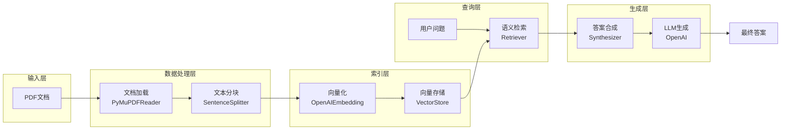
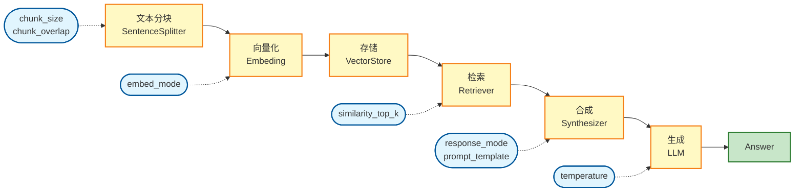
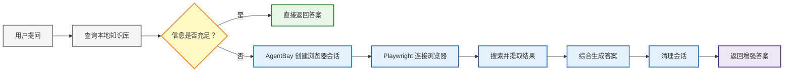

# LlamaIndex 深度实战：用《长安的荔枝》学会构建智能问答系统

> - **Published:** 2025-12-04  
> - **Source:** [LlamaIndex 深度实战：用《长安的荔枝》学会构建智能问答系统](https://mp.weixin.qq.com/s?__biz=MzIzOTU0NTQ0MA==&mid=2247556092&idx=1&sn=f1b4672bf5520d929f5370b413099830&poc_token=HDbluGmjBHkwDriDygl8lmyK4aBZTbol3orkz-vU)
> - **Tags:** `RAG`

## 第一部分：原理篇 - AI 如何像人一样"读书"

### 1.1 一个真实的需求

假设你手上有一本 170 页的小说《长安的荔枝》，你想快速了解：

- 主角是谁？
- 故事讲了什么？
- 荔枝最后是怎么送到长安的？

但你没时间读完整本书。这时候，你会怎么做？

人类的做法：

1. 翻到目录，找到相关章节

2. 快速浏览这些章节

3. 找到关键信息

4. 用自己的话总结答案

AI 能不能也这样做呢？ 答案是：可以！这就是我们今天要探讨的技术。

### 1.2 从"搜索"到"理解"

**传统搜索的局限**

你可能会想：用 Ctrl+F 搜索关键词不就行了？

让我们试试：

```javascript
搜索"主角" → 可能搜不到（书中可能用"李善德"而不是"主角"）搜索"李善德" → 找到 50 处，但哪句话说明他是主角？
```

问题：传统搜索只能做精确匹配，不能理解语义。

#### 直接问 ChatGPT？

你可能又想：直接问 ChatGPT 不就行了？

问题：

- ChatGPT 没读过《长安的荔枝》
- 它可能会"编造"一个答案
- 无法引用原文，不可追溯

### 1.3 理想的解决方案

我们需要一个系统，它能：

1.**"读"过这本书** - 理解书中的内容

2.**找到相关段落** - 像人一样快速定位

3.**理解并回答** - 用自然语言给出答案

4.**可以追溯** - 告诉你答案来自哪里

这就是 RAG（检索增强生成） 系统要做的事情。

### 1.4 工作原理：三个关键步骤

让我用一个类比来解释：

#### 步骤 1：建立"索引卡片"（Indexing）

想象你在读书时做笔记：

```js
卡片 1：李善德是上林署的监事...
卡片 2：他接到了一个艰巨的任务...
卡片 3：荔枝必须新鲜送达长安...
...
```

AI 的做法：

1.把书切成一段段（比如每段 500 字），这叫 **Chunking**。

2.为每段生成一个"数字指纹"（向量），这叫 **Embedding**。

3.把这些"指纹"（向量）和原文（段落）存起来，放入**向量数据库**。

```css
段落 1 → [0.1, 0.3, -0.2, ...] (1536 个数字)
段落 2 → [0.2, -0.1, 0.4, ...]
段落 3 → [-0.1, 0.2, 0.1, ...]
```

这个过程叫做**向量化**（Embedding）。

#### 步骤 2：找到相关段落（Retrieval）

当你问"主角是谁？"时：

1.AI 把你的问题也转成"数字指纹"

```javascript
"主角是谁？" → [0.15, 0.25, -0.15, ...]
```

2.对比所有段落的"指纹"，找最相似的

```js
问题指纹 vs 段落1指纹 → 相似度 0.95 ✓
问题指纹 vs 段落2指纹 → 相似度 0.60
问题指纹 vs 段落3指纹 → 相似度 0.85 ✓
```

3.挑出最相似的 3-5 段

这个过程叫做语义检索。

#### 步骤 3：生成答案（Generation）

AI 拿到相关段落后：

```markdown
输入给 AI：
...
相关段落（上下文）：
1. 李善德是上林署的监事，从九品下...
2. 他在长安城南买了一座宅子...
3. 这天，他接到了一个艰巨的任务...

问题：主角是谁？
...

AI 输出：
主角是李善德。他是上林署的监事，从九品下的官职...
```

这个过程叫做增强生成。

### 1.5 关键参数的作用

在这个过程中，有几个重要的"旋钮"可以调节。让我们用《长安的荔枝》中的实际文本来理解它们的作用。

#### 参数 1：段落大小（chunk\_size）

类比：做笔记时，每张卡片写多少字？

让我们看看同一段文本在不同 chunk\_size 下的效果：

**小卡片示例（约 300 字，适合 chunk\_size=512）：**

```javascript
李善德是上林署的监事，从九品下。他在长安城南买了一座宅子，虽然不大，但也算是有了自己的家。这天早上，他刚到上林署，就被叫到了上司的房间。

"李监事，有个任务交给你。"上司开门见山地说。

"请上司吩咐。"李善德恭敬地回答。

"圣人想吃新鲜荔枝，你去岭南采办，十天内送到长安。"

李善德愣住了。从岭南到长安，路程遥远，荔枝又极易腐烂，这几乎是不可能完成的任务。
```

**大卡片示例（约 600 字，适合 chunk\_size=1024）：**

```javascript
李善德是上林署的监事，从九品下。他在长安城南买了一座宅子，虽然不大，但也算是有了自己的家。这天早上，他刚到上林署，就被叫到了上司的房间。

"李监事，有个任务交给你。"上司开门见山地说。

"请上司吩咐。"李善德恭敬地回答。

"圣人想吃新鲜荔枝，你去岭南采办，十天内送到长安。"

李善德愣住了。从岭南到长安，路程遥远，荔枝又极易腐烂，这几乎是不可能完成的任务。但他知道，这不是可以拒绝的。

回到自己的小房间，李善德开始思考。荔枝，这种南方的水果，离开树枝后很快就会变色变味。从岭南到长安，即使日夜兼程，也要七八天。如何让荔枝保持新鲜？

他想起了一些传闻：有人用冰窖，有人用蜜浸，还有人用特制的木盒。但这些方法都没有经过验证。更重要的是，他需要计算成本。上林署给的预算有限，每一文钱都要精打细算。

李善德拿出纸笔，开始列清单：采购荔枝的费用、运输工具、人工、沿途驿站的开支……数字越算越大，他的眉头皱得越来越紧。
```

效果对比：

- **小卡片：** 精确定位到"接到任务"这个事件，适合回答"李善德接到了什么任务？"
- **大卡片：** 包含任务的来龙去脉和李善德的思考，适合回答"李善德面临什么困难？"

#### 参数 2：检索数量（top\_k）

类比：找几张相关的卡片？

假设用户问："李善德是个怎样的人？"

**检索 3 张卡片（top\_k=3）：**

```js
卡片 1: 李善德是上林署的监事，从九品下。他做事谨慎，
       从不出错...

卡片 2: 面对上司的质疑，李善德没有辩解，只是默默地
       继续工作...

卡片 3: 他知道这个任务几乎不可能完成，但还是决定
       尽全力去做...
```

→ AI 回答："李善德是个谨慎、踏实、有责任心的人。"

**检索 10 张卡片（top\_k=10）：**

```js
（包含上面 3 张，还有：）

卡片 4: 李善德在计算成本时，精确到每一文钱...

卡片 5: 他想起了家乡的荔枝树，那时候他还是个孩子...

卡片 6: 面对老兵的嘲讽，李善德没有生气，反而虚心请教...

卡片 7: 深夜，他还在研究地图，寻找最快的路线...

...
```

→ AI 回答："李善德是个谨慎、踏实、有责任心的人。他精于计算， 注重细节，同时也有着温情的一面。面对困难，他不轻言放弃， 而是积极寻找解决方案。他谦逊好学，愿意向他人请教。"

**效果对比：**

- **top\_k=3:** 快速回答，但信息有限；
- **top\_k=10:** 全面深入，但耗时更长；

#### 参数 3：重叠大小（overlap）

类比：相邻卡片之间重复多少内容？

假设有这样一段文本：

**原文：**

```js
...李善德想起了一个办法。他曾听说，岭南的果农会用特殊的方法保存荔枝。如果能找到这些果农，或许就能解决保鲜的问题。

第二天一早，李善德就出发了。他先去了市场，打听岭南商人的消息。功夫不负有心人，他终于找到了一个来自岭南的果商...
```

**无重叠切分：**

```js
卡片 1: ...李善德想起了一个办法。他曾听说，岭南的果农会用
       特殊的方法保存荔枝。如果能找到这些果农，或许就能
       解决保鲜的问题。

卡片 2: 第二天一早，李善德就出发了。他先去了市场，打听
       岭南商人的消息。功夫不负有心人，他终于找到了一个
       来自岭南的果商...
```

→ 问题：如果用户问"李善德如何解决保鲜问题？"，可能只检索到卡片1， 看到"想到办法"但看不到"找到果商"这个关键行动。

**有重叠切分（overlap=50字）：**

```js
卡片 1: ...李善德想起了一个办法。他曾听说，岭南的果农会用
       特殊的方法保存荔枝。如果能找到这些果农，或许就能
       解决保鲜的问题。

       第二天一早，李善德就出发了。他先去了市场...

卡片 2: ...如果能找到这些果农，或许就能解决保鲜的问题。

       第二天一早，李善德就出发了。他先去了市场，打听
       岭南商人的消息。功夫不负有心人，他终于找到了一个
       来自岭南的果商...
```

→ 两张卡片都包含了从"想法"到"行动"的完整过程，无论检索到哪张， 都能给出完整的答案。

**效果对比：**

- **无重叠：** 存储空间小，但可能丢失跨段落的关键信息；
- **有重叠：** 占用空间稍大，但保证了信息的连续性和完整性；

#### 参数定义总结

现在让我们用一张表格总结这三个关键参数：

参数名|英文名|定义|作用阶段|推荐值
-|-|-|-|-
段落大小|chunk_size|每个文本块包含多少个token<br>(约0.75个汉字=1token)|文本分块|512-2048
检索数量|top_k|检索时返回多少个最相关的文本块|语义检索|3-10
重叠大小|chunk_overlap|相邻文本块之间重复多少个token|文本分块|50-256

**快速记忆：**

- `chunk\_size`：每张卡片写多少字
- `top\_k`：找几张相关卡片
- `chunk\_overlap`：相邻卡片重复多少内容

### 1.6 现在，让我们引入术语

现在你已经理解了原理，让我们用专业术语重新描述一遍：

通俗说法|专业术语|英文
-|-|-
把书切成段落|文本分块|Chunking
生成数字指纹|向量化/嵌入|Embedding
存储指纹|向量数据库|Vector Store
找相似段落|语义检索|Semantic Retrieval
生成答案|增强生成|Augmented Generation
整个系统|检索增强生成|RAG (Retrieval-Augmented Generation)

### **1.7 小结**

**核心思想：**

1.把文档切成小块，每块生成"数字指纹"；

2.问题也生成"指纹"，找最相似的块；

3.把相关块和问题一起给 AI，让它生成答案；

**关键优势：**

✅ 基于你的文档（不会编造）

✅ 语义理解（不只是关键词）

✅ 可以追溯（知道答案来源）

**接下来：** 让我们看看如何用代码实现这个系统！

## 第二部分：实战篇 - 用 LlamaIndex 实现问答系统

### 2.1 什么是 LlamaIndex？

在上一部分，我们了解了 RAG（检索增强生成）的通用原理。要将这个原理付诸实践，我们需要一个“框架”来帮我们处理所有繁琐的步骤，比如：加载文档、切割文本、调用 Embedding API、管理向量存储、检索、构建 Prompt、调用 LLM 等。

**LlamaIndex 就是这样一个“数据框架”，它专门为“连接大语言模型 (LLM) 与外部数据”而生。**

通俗地说，LlamaIndex 就像一个超级“图书管理员”：

- 你给它一本（或一万本）书（**外部数据**）。
- 它会帮你把书拆解、消化、并制作成一套精密的“索引卡片”（**索引过程**）。
- 当你提出问题时（查询），它能迅速帮你找到所有相关的“卡片”，并让 LLM 总结成通顺的答案（**检索与生成**）。

我们接下来要实战的，就是如何使用 LlamaIndex 这个强大的工具，来搭建我们自己的《长安的荔枝》问答系统。


### 2.2 预期效果

在开始写代码前，先看看我们要实现什么效果：

```python
# 加载《长安的荔枝》
loader = DocumentLoader("长安的荔枝.pdf")

# 构建索引（建立"卡片系统"）
index = VectorStoreIndex.from_documents(documents)
# 开始提问
query_engine = index.as_query_engine()

# 问题 1
response = query_engine.query("主角是谁？")
# 答案：李善德。他是上林署的监事...

# 问题 2
response = query_engine.query("故事的主线是什么？")
# 答案：故事围绕李善德接到运送荔枝的任务展开...

# 问题 3
response = query_engine.query("荔枝最后是怎么送到长安的？")
# 答案：通过快速的船运沿着水路，然后陆路运输...
```

**目标：** 用不到 50 行代码实现这个功能！

### 2.3 最简代码清单

先看完整代码，有个整体印象：

```python
from llama_index.core import VectorStoreIndex, Settings
from llama_index.llms.openai import OpenAI
from llama_index.embeddings.openai import OpenAIEmbedding
from llama_index.readers.file import PyMuPDFReader

# 1. 配置 AI 服务
Settings.llm = OpenAI(
    model="gpt-3.5-turbo",
    api_key="your_api_key"
)
Settings.embed_model = OpenAIEmbedding(
    model="text-embedding-3-small",
    api_key="your_api_key"
)

# 2. 加载 PDF
reader = PyMuPDFReader()
documents = reader.load(file_path="长安的荔枝.pdf")
# documents: 170 个 Document 对象，每个代表一页

# 3. 构建索引（这一步会调用 Embedding API）
index = VectorStoreIndex.from_documents(documents)
# 内部做了：切分 → 向量化 → 存储

# 4. 创建查询引擎
query_engine = index.as_query_engine(similarity_top_k=3)
# similarity_top_k=3: 检索 3 个最相关的段落

# 5. 提问
response = query_engine.query("主角是谁？")
# 内部做了：问题向量化 → 检索相似段落 → 调用 LLM 生成答案

print(response.response)
```

**代码量：** 核心代码不到 30 行！

**关键 API：**

- Settings: 全局配置（LLM 和 Embedding）
- PyMuPDFReader: PDF 读取器
- VectorStoreIndex: 向量索引（核心）
- as\_query\_engine(): 创建查询引擎
- query(): 提问并获取答案

### 2.4 核心 API 详解

#### API 1: Settings - 全局配置

```python
from llama_index.core import Settings
from llama_index.llms.openai import OpenAI
from llama_index.embeddings.openai import OpenAIEmbedding

# 配置 LLM（用于生成答案）
Settings.llm = OpenAI(
    model="gpt-3.5-turbo",      # 模型名称
    temperature=0.1,             # 温度（0=确定性，1=创造性）
    api_key="your_key"          # API 密钥
)

# 配置 Embedding（用于向量化）
Settings.embed_model = OpenAIEmbedding(
    model="text-embedding-3-small",  # Embedding 模型
    api_key="your_key"               # API 密钥
)
```

**作用：**

- `Settings.llm`: 负责理解问题和生成答案；
- `Settings.embed\_model`: 负责把文本转成向量；

**实际例子：**

```python
# Embedding 的工作
text = "李善德是上林署的监事"
vector = Settings.embed_model.get_text_embedding(text)
# vector: [0.123, -0.456, 0.789, ...] (1536 个数字)

# LLM 的工作
prompt = "问题：主角是谁？\n答案："
answer = Settings.llm.complete(prompt)
# answer: "李善德"
```

#### API 2: PyMuPDFReader - PDF 加载

```python
from llama_index.readers.file import PyMuPDFReader

reader = PyMuPDFReader()
documents = reader.load(file_path="长安的荔枝.pdf")
```

**输入：** PDF 文件路径

**输出：** `List[Document]` ，每个 Document 包含：

```bash
Document(
    text="第一章\n\n李善德站在...",  # 页面文本
    metadata={
        "page_label": "1",              # 页码
        "file_name": "长安的荔枝.pdf"   # 文件名
    }
)
```

**实际例子：**

```python
documents = reader.load("长安的荔枝.pdf")
print(f"共 {len(documents)} 页")  # 共 170 页
print(documents[0].text[:100])     # 第一页前 100 字
# 输出：第一章\n\n李善德站在长安城南的一座宅子门前...
```

#### API 3: VectorStoreIndex - 构建索引

```python
from llama_index.core import VectorStoreIndex

index = VectorStoreIndex.from_documents(
    documents,           # 文档列表
    show_progress=True   # 显示进度条
)
```

**内部流程：**

```cpp
1. 文本分块
   170 页 → 切分 → 约 500 个 chunks（默认每个 512 tokens）

2. 向量化（调用 Embedding API）
   chunk 1: "李善德是..." → [0.1, 0.3, -0.2, ...]
   chunk 2: "他接到任务..." → [0.2, -0.1, 0.4, ...]
   ...

3. 存储
   把 (text, vector) 存到向量数据库
```

**实际例子：**

```makefile
# 默认配置
index = VectorStoreIndex.from_documents(documents)
# - chunk_size: 512 tokens
# - chunk_overlap: 20 tokens
# - 约 500 个 chunks

# 自定义配置
from llama_index.core.node_parser import SentenceSplitter

Settings.text_splitter = SentenceSplitter(
    chunk_size=1024,      # 更大的块
    chunk_overlap=128     # 更多重叠
)
index = VectorStoreIndex.from_documents(documents)
# - 约 250 个 chunks
```

**持久化（避免重复构建）：**

```makefile
# 首次构建并保存
index = VectorStoreIndex.from_documents(documents)
index.storage_context.persist(persist_dir="./storage")

# 后续直接加载（快速）
from llama_index.core import StorageContext, load_index_from_storage

storage_context = StorageContext.from_defaults(persist_dir="./storage")
index = load_index_from_storage(storage_context)
```

#### API 4: as\_query\_engine() - 创建查询引擎

```python
query_engine = index.as_query_engine(
    similarity_top_k=3,          # 检索 3 个最相关的 chunks
    response_mode="compact"      # 响应模式
)
```

**参数说明：**

**similarity\_top\_k：** 检索多少个相关段落

```python
# 检索 3 个
query_engine = index.as_query_engine(similarity_top_k=3)
# 问"主角是谁？" → 找到 3 个最相关的段落 → 生成答案

# 检索 10 个
query_engine = index.as_query_engine(similarity_top_k=10)
# 问"故事主线？" → 找到 10 个相关段落 → 综合生成答案
```

**response\_mode：** 如何综合多个段落

```python
# compact: 合并所有段落，一次调用 LLM
query_engine = index.as_query_engine(response_mode="compact")

# refine: 逐步精炼答案（多次调用 LLM）
query_engine = index.as_query_engine(response_mode="refine")

# tree_summarize: 树形总结（适合大量段落）
query_engine = index.as_query_engine(response_mode="tree_summarize")
```

#### API 5: query() - 提问

```python
response = query_engine.query("主角是谁？")
```

内部流程：

```python
1. 向量化问题
   "主角是谁？" → [0.15, 0.25, -0.15, ...]

2. 检索相似段落（top_k=3）
   计算相似度 → 找到 3 个最相关的 chunks

3. 构建 Prompt
   上下文：chunk1 + chunk2 + chunk3
   问题：主角是谁？

4. 调用 LLM
   LLM 基于上下文生成答案

5. 返回结果
   response.response: "李善德。他是..."
   response.source_nodes: [chunk1, chunk2, chunk3]
```

返回值：

```python
response = query_engine.query("主角是谁？")

# 答案文本
print(response.response)
# "李善德。他是上林署的监事..."

# 来源段落
for i, node in enumerate(response.source_nodes):
    print(f"来源 {i+1}:")
    print(f"  相似度: {node.score:.3f}")
    print(f"  内容: {node.text[:100]}...")
```

### 2.5 完整示例：对话式问答

```python
from llama_index.core import VectorStoreIndex, Settings
from llama_index.llms.openai import OpenAI
from llama_index.embeddings.openai import OpenAIEmbedding
from llama_index.readers.file import PyMuPDFReader

# 配置
Settings.llm = OpenAI(model="gpt-3.5-turbo", api_key="your_key")
Settings.embed_model = OpenAIEmbedding(model="text-embedding-3-small", api_key="your_key")

# 加载和索引
reader = PyMuPDFReader()
documents = reader.load("长安的荔枝.pdf")
index = VectorStoreIndex.from_documents(documents)

# 创建聊天引擎（支持多轮对话）
chat_engine = index.as_chat_engine()

# 多轮对话
response1 = chat_engine.chat("这本书的主角是谁？")
print(f"AI: {response1.response}")
# AI: 主角是李善德...

response2 = chat_engine.chat("他的职位是什么？")
print(f"AI: {response2.response}")
# AI: 他是上林署的监事...（记得上一轮说的是李善德）

response3 = chat_engine.chat("他遇到了什么困难？")
print(f"AI: {response3.response}")
# AI: 他接到了运送荔枝的艰巨任务...

# 重置对话
chat_engine.reset()
```

**chat\_engine vs query\_engine：**

- `query\_engine`: 每次独立提问，不记忆上下文；
- `chat\_engine`: 多轮对话，记住之前的问答；

### 2.6 小结

**核心 API 总结：**

API|作用|关键参数
-|-|-
`Settings`|全局配置|`llm` `embed_model`
`PyMuPDFReader`|加载PDF|`file_path`
`VectorStoreIndex`|构建索引|`documents`
`as_query_engine()`|创建查询引擎|`similarity_top_k` `response_mode`
`query()`|单次提问|`query_str`
`as_chat_engine()`|创建聊天引擎|-
`chat()`|多轮对话|`message`

代码量：

- 最简实现：< 30 行
- 完整功能：< 100 行

**接下来：** 让我们看看不同参数配置的实际效果！

## 第三部分：优化篇 - 参数调优的实战效果

在开始实验之前，让我们先回顾一下关键参数的定义：

**参数速查表**

参数|含义|作用|典型值
-|-|-|-
chunk_size|文本块大小|控制每个文本块包含多少token(约0.75汉字=1token)|512 / 1024 / 2048
chunk_overlap|文本块重叠|相邻文本块之间重复的token数量,防止信息在边界处丢失|50 / 128 / 256
top_k|检索数量|查询时返回多少个最相关的文本块|3 / 5 / 10
temperature|随机性|LLM生成答案时的随机程度(0=确定,1=创造)|0.1 / 0.2 / 0.3
response_mode|合成模式|如何将多个文本块合成为答案|compact / refine / tree_summarize

**参数之间的关系：**

- `chunk\_size` ↑ → 上下文更完整，但可能包含噪音；
- `chunk\_overlap` ↑ → 信息连续性更好，但存储空间增加；
- `top\_k` ↑ → 答案更全面，但耗时和成本增加；
- `temperature` ↑ → 答案更有创意，但可能不够准确；

### 3.1 实验设计思路

为了让你真正理解参数的作用，我们设计了两类实验：

#### 第一类：单参数影响实验（3.2节）

目标：孤立地展示每个参数的独立效果。

- **实验1：** 只改变 chunk\_size，观察对理解复杂信息的影响；
- **实验2：** 只改变 top\_k，观察对信息全面性的影响；
- **实验3：** 只改变 chunk\_overlap，观察对跨段落信息的保护；

#### 第二类：组合参数优化实验（3.3节）

目标：展示在实际场景中如何组合参数。

- **实验4：** 简单事实查询 - 展示基础配置的适用性；
- **实验5：** 复杂情节理解 - 展示参数优化的价值；
- **实验6：** 宏观主题理解 - 展示深度配置的必要性；

**所有实验都使用：**

- 《长安的荔枝》全书（170页）
- 相同的中文 Prompt 模板
- 真实的 LlamaIndex 输出结果

### 3.2 单参数影响实验

#### 实验1：chunk\_size 的影响

**测试问题：**李善德在整个故事中的心理变化是怎样的？从开始到结束他的想法有什么转变？

**为什么选这个问题：**

- 心理变化是渐进的，分散在全书各处；
- 小 chunk 只能看到片段，难以把握整体变化；
- 大 chunk 能够包含更完整的心理描写；

**实验配置：**

配置|chunk_size|chunk_overlap|top_k
-|-|-|-
配置A|256|50|5
配置B|512|50|5
配置C|1024|50|5
配置D|2048|50|5

**实验结果：**

**配置A（chunk\_size=256）**

```js
李善德在整个故事中的心理变化是非常明显的。一开始，他在与赵欣宁的交锋中表现出迷茫和无措，不知如何回应。随后，在苏谅的提议下，他展现出了一种决断和果断的态度，愿意冒险尝试新的商业方式。他在这个阶段表现出了对未来的信心和决心。然而，随着故事的发展，他又陷入了迷茫和犹豫之中，开始怀疑自己的决定和未来的走向。最终，他选择放弃一切，成为一个荔枝老农，过着平静的生活。整个过程中，李善德的心理变化可以总结为迷茫、决断、犹豫和最终的放弃。
```

⭐⭐ 简短，只提到4个阶段，缺少细节。

**配置B（chunk\_size=512）**

```js
李善德在整个故事中的心理变化是非常明显的。一开始，他在与赵欣宁的交锋中表现出迷茫和无措，不知如何回应。但随着故事的发展，他逐渐展现出果断和决绝的一面。在与苏谅的交流中，他展现出了敢于赌博和冒险的态度，表现出对未来的信心和决心。在与韩承的对话中，他展现出了谄媚和顺从的一面，表现出对权力的敬畏和追求。最后，他选择了隐居种荔枝树，放弃了世俗的权力和利益，展现出了对过去的反思和悔悟。整个故事中，李善德的心理变化可以总结为从迷茫到果断，再到悔悟和放下世俗欲望的过程。
```

⭐⭐⭐ 增加了"谄媚和顺从"、"反思和悔悟"等细节。

**配置C（chunk\_size=1024）**

```js
李善德在整个故事中的心理变化是非常明显的。一开始，他在与赵欣宁的交锋中表现出迷茫和无奈，不知如何回应对方的挑衅。随着故事的发展，他开始展现出决心和勇气，决定尝试新的商业合作方式，并且毫不犹豫地接受了这个挑战。在接受了试验的过程中，他经历了挫折和困惑，甚至产生了放弃的念头。然而，在一次偶然的机会下，他突然领悟到为官之道，表现出了谄媚之态，展现出了一种转变和妥协的心态。最终，他选择了放下过去的一切，成为一个荔枝老农，专心致志地照料果园，过着平静的生活。整个过程中，李善德的想法经历了从迷茫到决心，再到妥协和放下的转变，展现出了一个复杂而丰富的内心世界。
```

⭐⭐⭐⭐ 更详细，提到"妥协"、"复杂而丰富的内心世界"。

**配置D（chunk\_size=2048）**

```js
李善德在整个故事中的心理变化是非常明显的。一开始，他在与赵欣宁的交锋中表现出迷茫和无措，不知如何回应对方的挑衅。随着故事的发展，他逐渐展现出决断和果断的一面，愿意冒险尝试新的商业合作方式，展现出一种敢于拼搏的态度。在接受苏諒的提议后，他更是毫不犹豫地选择了冒险，表现出对未来的信心和决心。然而，随着故事的进展，他又陷入了困惑和犹豫之中，感到自己无法摆脱宿命的束缚，甚至产生了放弃的念头。最终，他选择了一个与过去完全不同的生活方式，成为一个荔枝老农，放下了一切世俗的纷扰，选择了平静和宁静。整个过程中，李善德的心理变化经历了迷茫、决断、困惑和放下的过程，展现出了一个人在面对困境和选择时内心的挣扎和成长。
```

⭐⭐⭐⭐⭐ 最完整，包含"宿命束缚"、"内心挣扎和成长"等深层分析。

效果对比：

配置|描述深度|心理阶段数|关键词丰富度
-|-|-|-
配置A(256)|简单|4个|低
配置B(512)|中等|4个|中
配置C(1024)|详细|5个|高
配置D(2048)|深入|6个+|很高

结论：

- **chunk\_size 越大，对心理变化的理解越深入；**
- 256 只能捕获基本轨迹，2048 能分析深层原因；
- 对于需要理解渐进变化的问题，建议使用 **1024 或更大**；
- 但要注意：过大的 chunk 会增加索引时间和存储空间；

#### 实验2：top\_k 的影响

**测试问题：** 小说中出现了哪些重要人物？他们分别是什么身份？

**为什么选这个问题：**

- 人物信息分散在全书各处；
- 需要检索多个段落才能全面回答；
- 能清晰展示 top\_k 对信息全面性的影响；

**实验配置：**

配置|chunk_size|chunk_overlap|top_k
-|-|-|-
配置A|1024|100|2
配置B|1024|100|5
配置C|1024|100|10

**实验结果：**

**配置A（top\_k=2）**

```
在这段文本中，出现了两个重要人物。一个是李善德，他是主要的故事主角，是一个有抱负的年轻人，希望通过进入大人物的视野来实现自己的目标。另一个是林邑奴，虽然在文本中没有详细介绍他的身份，但可以看出他对李善德有一定的重要性，因为李善德在意他的位置并打算回来查看。林邑奴可能是一个与故事情节相关的重要角色，但具体身份需要在后续文本中进一步揭示。
```

✅ 找到 **2 个人物**，信息有限。

**配置B（top\_k=5）**

```
重要人物包括李善德、圣人、贵妃、卫国公杨国忠、韩承和杜甫。其中，李善德是主角，是一个普通人，希望通过进入大人物的视野来改变自己的命运；圣人和贵妃是全天下最著名的伉俪，身份尊贵，受人景仰；卫国公杨国忠是长安城里最让人颤栗的名字，处理全天下的大事；韩承是刑部比部司任主事，大家都叫他韩十四；杜甫是一位诗文不错，得过圣人青睐的人，一直在京待选。这些人物在小说中扮演着重要的角色，影响着故事的发展。
```

✅ 找到 **6 个人物**，信息较全面。

**配置C（top\_k=10）**

```md
小说中出现了以下重要人物：
1. 李善德：主要角色，是一个小吏，希望通过进入大人物的视野来提升自己的地位。
2. 圣人：长安城里最著名的人物之一，与贵妃关系密切。
3. 贵妃：圣人的伴侣，与圣人关系恩爱。
4. 卫国公杨国忠：长安城里最让人颤栗的名字，处理全天下的大事。
5. 韩承：刑部比部司任主事，大家都称他为韩十四。
6. 杜甫：诗文不错，得过圣人青睐，一直在京待选。
7. 冯元一：名刺上的名字，可能与杨国忠有关系。
8. 赵欣宁：带着一大队骑兵，与李善德有一段交集。
9. 鱼朝恩：宫市副使，近年来蹿升很快，颇得青睐。
以上人物身份包括小吏、圣人、贵妃、卫国公、主事、诗人、宫市副使等。每个人物在故事中扮演着不同的角色和起到不同的作用。
```

✅ 找到 **9 个人物**，信息最全面，还有结构化呈现。

效果对比：

配置|找到人物数|信息完整度|结构化程度
-|-|-|-
配置A(top_k=2)|2个|⭐⭐|低
配置B(top_k=5)|6个|⭐⭐⭐⭐|中
配置C(top_k=10)|9个|⭐⭐⭐⭐⭐|高（编号列表）

**结论：**

- **top\_k 越大，检索到的信息越全面；**
- top\_k=2 只能找到主角，top\_k=10 能找到几乎所有重要人物；
- 对于需要列举多个要素的问题，建议 **top\_k ≥ 5**；
- 但要注意：top\_k 过大会增加 Token 消耗和响应时间；

#### 实验3：chunk\_overlap 的影响

**测试问题：** 李善德从接到任务到第一次尝试运送荔枝，这个过程中他的计划是如何一步步形成的？请详细描述他的思考和准备过程。

**为什么选这个问题：**

- 计划形成是一个连续的思考过程，答案跨越多个段落；
- 涉及"接到任务 → 思考方案 → 准备实施"的完整链条；
- 无 overlap 时，关键的思考转折可能在chunk边界处被切断；
- 有 overlap 时，能保持思维过程的连贯性；

**实验配置：**

配置|chunk_size|chunk_overlap|top_k
-|-|-|-
配置A|512|0|5
配置B|512|100|5
配置C|512|200|5

**实验结果：**

**配置A（overlap=0）**

```
李善德接到任务后，首先意识到要解决的问题是如何将新鲜荔枝运送到长安。他意识到只有延缓荔枝变质的时间或提高转运速度这两种方法。对于延缓荔枝变质的时间，他发现了一种双层瓮，可以通过在瓮内放入盐水洗过的荔枝，并在外层注入冷水来保持温度，从而延缓荔枝变质。然而，这只是解决问题的一部分。
他意识到真正的麻烦在于提高转运速度。为此，他购置了近百匹马、雇佣了几十名骑手以及数条草撇快船，分成四队准备出发。在这个过程中，他还进行了一次试验，委托阿僮进行掇树之术，即提前截取荔枝干节，放在土里温养，以延长荔枝的存活时间。
然而，在即将离开广州之时，他又遇到了意外，发现经略府士兵正在砍伐荔枝树。这时，他意识到自己不能等到十九日和荔枝转运队一起出发，必须提前摸排线路，清查所有的隐患...
```

⭐⭐⭐ 包含主要步骤，但叙述有跳跃感，"然而"突然出现。

**配置B（overlap=100）**

```
李善德接到任务后，首先意识到要解决的问题是如何将新鲜荔枝运送到长安，他意识到只有延缓荔枝变质的时间或提高转运速度这两种方法。在延缓荔枝变质的时间方面，他发现了一种双层瓮，通过用盐水洗过荔枝，放入内层，坛口密封，然后外层注入冷水，每半日更换一次的方法来保鲜。在提高转运速度方面，他购置了近百匹马、雇佣了几十名骑手以及数条草撇快船，分成四队同时出发。
然而，在即将离开之时，他遇到了阿僮的意外，发现经略府士兵正在砍伐荔枝树。这时，他意识到提前截取荔枝干节，放在土里温养，等隐隐长出白根毛，再移植入瓮中，存活时间会更长，即"掇树之术"。他意识到这是一个保鲜的新方法，决定将这个方法应用到自己的计划中。
在和苏谅的交谈中，李善德提出了新的想法，即不仅提速，还要找到保鲜的方法。他提出了双管齐下的计划，即使用双层瓮保鲜，同时采用掇树之术延长荔枝的存活时间。尽管苏谅对此表示怀疑，认为荔枝带枝最多只能延缓半日，但李善德坚信自己的计划，坚持认为这是胜机所在。
最终，李善德通过不断的思考和准备，形成了结合双层瓮和掇树之术的计划，以确保荔枝在转运过程中保持新鲜。他不断调整和完善计划，最终准备好了一切，准备启程前往长安。整个过程中，李善德展现出了坚定的信念和不断探索的精神，最终成功制定了一套完善的运输计划。
```

⭐⭐⭐⭐⭐ 叙述连贯，"掇树之术"解释详细，思维转折清晰。

**配置C（overlap=200）**

```
李善德接到任务后，首先意识到要解决的问题是如何将新鲜荔枝运送到长安。他意识到只有延缓荔枝变质的时间或提高转运速度这两种方法。在延缓荔枝变质方面，他发现了一种双层瓮，可以通过盐水洗净荔枝，放入内层，外层注入冷水来保持荔枝新鲜。然而，这只是暂时的解决方案。
在提高转运速度方面，他购置了近百匹马、雇佣了骑手和草撇快船，分成四队同时出发。他还进行了试验，提前截取荔枝枝节，进行掇树之术，以延长荔枝的存活时间。这个方法虽然不是新发明，但对于解决荔枝运输问题有一定帮助。
在试验过程中，他发现了一个保鲜的法子，即不切枝而是切干，可以延缓荔枝变质的时间。他向苏谅借钱，准备实施这个新的想法。尽管苏谅提出了疑虑，认为荔枝带枝最多只能延缓半日，但李善德坚信这个方法可以成功。
总的来说，李善德的计划是通过不断思考和尝试，逐步形成的。他从最初的双层瓮保鲜到掇树之术，再到最后的切干法子，不断改进和完善自己的方案，以确保荔枝能够在运输过程中保持新鲜，最终成功完成任务。
```

⭐⭐⭐⭐⭐ 逻辑清晰，强调"不断改进和完善"的过程。

**效果对比：**

配置|叙述连贯性|思维转折|细节完整度
-|-|-|-
配置A(overlap=0)|中|有跳跃|中
配置B(overlap=100)|高|清晰|高
配置C(overlap=200)|高|非常清晰|很高

**结论：**

- **overlap 对连续思考过程的影响显著；**
- overlap=0 时，思维转折在chunk边界处被切断，导致叙述跳跃；
- overlap=100 已经能很好地保持信息连续性；
- overlap=200 进一步增强，但提升幅度相对较小；
- 建议：对于需要理解连续过程的问题，使用 overlap ≥ 100；

### 3.3 组合参数优化实验

#### 实验4：简单事实查询场景

**测试问题：** 李善德的官职是什么？

**场景说明：** 这是最简单的事实查询，答案明确且集中

**实验配置：**

配置|chunk_size|chunk_overlap|top_k|说明
-|-|-|-|-
默认配置|512|20|3|快速查询配置
过度配置|2048|256|10|资源浪费配置

**实验结果：**

**默认配置**

```
根据上文信息，李善德的官职是敕命的荔枝使。
```

**过度配置**

```
李善德的官职是监事。在文中提到，李善德被贡选到国子监专攻算学十书，以明算科及第，随后被诠选到了司农寺，在上林署里做一个监事。监事是一个庶职，虽然不是高官显贵，但在官场中也有一定的地位和责任。
```

**意外发现：**

- 默认配置给出"荔枝使"（临时任命）；
- 过度配置给出"监事"（正式官职）+ 详细背景；
- 这说明：即使是简单问题，更大的配置也能提供更准确和完整的信息；

**结论：**

- 简单事实查询用默认配置**通常足够**；
- 但如果需要**更准确或更详细**的答案，适度增加配置有帮助；
- 需要权衡：速度 vs 准确性；

#### 实验5：复杂情节理解场景

**测试问题：** 李善德是如何一步步解决荔枝运输中的保鲜难题的？每一步他做了什么？

**场景说明：** 需要理解完整的解决过程，涉及多个步骤

**实验配置：**

配置|chunk_size|chunk_overlap|top_k|说明
-|-|-|-|-
默认配置|512|20|3|可能信息不足
优化配置|1024|128|6|平衡配置

**实验结果：**

**默认配置**

```
李善德一步步解决荔枝运输中的保鲜难题。首先，他发现了一种双层瓮，用于海运香料时可以防止味道散失，他认为可以用来运输荔枝。他将荔枝用盐水洗过，放入内层，坛口密封；然后外层注入冷水，每半日更换一次，以保持瓮内温度不致太热。这是他的第一步。
其次，他购置了近百匹马、雇佣了几十名骑手以及数条草撇快船，分成四队，携带装满了荔枝的双层瓮，从四条路同时出发。这是他的第二步。
最后，他在详细计算后发现，民间转运队伍可以在十一天内冲到丹江口，加上他设计的保鲜措施和路线，速度可以提升三成，十一天完全可以抵达长安。他还听说可以用竹箨封藏荔枝，效果也不错。他决定等枝节枯萎后，立刻摘下荔枝，放入短竹筒内，再放入瓮中，效果更好。最后，他想到了自己在上林署监事时的经验，决定利用冰镇荔枝，因为冰镇是最有效的保鲜方法。这是他的第三步。
总的来说，李善德通过寻找合适的容器、提高转运速度、设计保鲜措施和利用冰镇等方法，一步步解决了荔枝运输中的保鲜难题。
```

⭐⭐⭐ 列出3个步骤，但组织略显混乱。

**优化配置**

```
李善德首先通过购买双层瓮，将荔枝用盐水洗过后放入内层，坛口密封，然后外层注入冷水，每半日更换一次，以延缓荔枝变质的时间。接着，他听说可以用竹箨封藏荔枝，效果也不错，于是决定等枝节枯萎后，立刻摘下荔枝，放入短竹筒内，再放入瓮中，以进一步提高保鲜效果。最后，他想到了利用冰镇的方法，因为他在上林署做了许多年监事，分管的业务是藏冰，每年冬季会凿冰储备。他意识到荔枝保鲜最有效的方法是取冰镇之，于是决定在荔枝转运中采用这种方式来保持荔枝的新鲜度。通过这些步骤，李善德逐步解决了荔枝运输中的保鲜难题，确保荔枝在长途运输过程中保持新鲜。
```

⭐⭐⭐⭐ 更清晰，3个步骤组织更好，逻辑连贯。

**效果对比：**

配置|步骤清晰度|逻辑连贯性|信息完整度
-|-|-|-
默认配置|中|中|中
优化配置|高|高|高

**结论：**

- 复杂情节需要**更大的 chunk **和**更多的 top\_k**；
- 优化配置能提供**更清晰、更有条理**的答案；
- 这是最常用的场景，建议使用 **1024/128/6** 的配置；

#### 实验6：宏观主题理解场景

**测试问题：** 这部小说通过李善德运送荔枝的故事，想要表达关于权力、责任和个人选择的什么思考？

**场景说明：** 需要综合全书信息，进行深层次理解。

**实验配置：**

配置|chunk_size|chunk_overlap|top_k|说明
-|-|-|-|-
默认配置|512|20|3|视野有限
优化配置|1024|128|6|信息较全
深度配置|2048|256|10|最全面

**实验结果：**

**默认配置**

```
这部小说通过李善德运送荔枝的故事，想要表达关于权力、责任和个人选择的思考。在故事中，李善德被赵欣宁搅局，面临着经略府的追杀和责难。他原本以为将荔枝送到京城可以开启仕途，但在经历一路的挫折和磨难后，他发现越接近成功，朋友越少，内心越愧疚。他意识到有些冲动是苟且不了的，有些心思是藏不住的。这表明在追逐权力和成功的过程中，个人的选择和责任是至关重要的。李善德最终意识到，权力并非一切，个人的内心和道德选择才是真正重要的。故事通过李善德的经历，反思了权力与责任之间的关系，以及个人在面对权力和责任时应该如何做出正确的选择。
```

⭐⭐ 简单提及权力和责任，缺少深度。

**优化配置**

```
这部小说通过李善德运送荔枝的故事，想要表达关于权力、责任和个人选择的思考。在故事中，李善德被赋予了重要的任务，即将新鲜荔枝送到长安，但在执行任务的过程中，他面临着各种困难和挑战。他在面对经略使、商人、朋友等各方的压力和考验时，展现出了不同的态度和选择。
首先，关于权力，故事中经略使、商人等权力角色对李善德施加了各种压力和要求，要求他完成任务或者放弃任务。这反映了权力对个人的影响和控制，以及在权力面前个人的无力和被动。李善德在这种权力的压迫下，不得不做出各种选择和决定。
其次，关于责任，李善德作为一个小官，承担着将荔枝送到长安的责任。他在执行任务的过程中，面临着各种困难和挑战，需要不断权衡利弊，承担责任和后果。他在面对各种压力和考验时，需要思考自己的责任和义务，以及如何承担责任和做出正确的选择。
最后，关于个人选择，故事中展现了李善德在面对各种困难和压力时，做出了不同的选择和决定。他在面对困境时，展现出了坚韧和勇气，同时也展现出了对权力和责任的思考和反思。他在最终选择面对死亡时，也表现出了对个人选择和命运的接受和坦然。
总的来说，这部小说通过李善德运送荔枝的故事，探讨了权力、责任和个人选择之间的关系，以及在面对权力和责任时个人的思考和抉择。通过这个故事，作者试图传达对于权力、责任和个人选择的深刻思考和探讨。
```

⭐⭐⭐⭐ 详细分析三个维度，结构清晰。

**深度配置**

```
这部小说通过李善德运送荔枝的故事，表达了关于权力、责任和个人选择的思考。首先，通过李善德在运送荔枝过程中所面临的困难和挑战，展现了权力对于个人的影响和限制。在故事中，各种权力机构和人物对于荔枝运送的态度和行为，直接影响了李善德的处境和选择。这反映了权力对于个人行动和选择的制约和影响。
其次，故事中还探讨了责任这一主题。李善德作为荔枝使，肩负着将荔枝送达长安的责任，但在面对各种困难和阻碍时，他需要权衡个人利益和责任之间的关系。他在故事中的选择和行动，展现了对责任的理解和承担，同时也反映了在权力面前责任的重要性和复杂性。
最后，故事还强调了个人选择的重要性。在面对权力的压力和责任的挑战时，李善德需要做出自己的选择和决定。他在故事中的行动和决策，体现了对于权力、责任和个人信念之间的平衡和选择。通过李善德的故事，读者可以思考权力、责任和个人选择之间的关系，以及在复杂环境中如何做出正确的决策。
```

⭐⭐⭐⭐⭐ 最全面，多角度分析，深入探讨。

**效果对比：**

配置|分析深度|结构化|角度多样性
-|-|-|-
默认配置|浅|低|单一
优化配置|中|高|三个维度
深度配置|深|高|多角度

**结论：**

- 主题理解需要**最强的配置**；
- 深度配置能提供**更深入、更多角度**的分析；
- 虽然成本较高，但对于**重要的分析任务是值得的**；
- 建议使用 **2048/256/10** 的配置；

### 3.4 参数配置建议

基于以上实验，我们总结出不同场景的最佳配置：

场景|适用问题|chunk_size|overlap|top_k|response_mode|特点
-|-|-|-|-|-|-
简单事实查询|"主角是谁?"<br>"故事发生在哪里?"|512|20|3|compact|快速、精确、低成本
复杂情节理解|"如何解决问题的?"<br>"完整过程是怎样的?"|1024|128|6|compact|平衡速度和质量<br>(最常用)
宏观主题理解|"故事的主题是什么?"<br>"作者想表达什么?"|2048|256|10|tree summarize|最全面<br>速度慢、成本高


Prompt 模板建议：

- 简单查询： `"请基于以下上下文简洁回答问题"`
- 复杂情节： `"请仔细阅读上下文，详细回答问题"`
- 宏观主题： `"请综合分析上下文，深入回答问题"`

### 3.5 参数速查表

参数|作用|取值范围|推荐值|影响
-|-|-|-|-
chunk_size|每个文本块的大|256-4096|512/1024/2048|上下文完整性
chunk_overlap|相邻块的重叠|0-512|20/128/256|信息连续性
similarity_top_k|检索段落数量|1-20|3/6/10|答案全面性
response_mode|响应合成模式|compact/refine/tree_summarize|compact|API调用次数
temperature|LLM 随机性|0.0-2.0|0.1-0.3|答案创造性

**参数组合示例：**

```shell
# 快速查询：512/20/3/compact/0.1
# 适合：简单事实问题

# 标准配置：1024/128/6/compact/0.2
# 适合：大多数情况（推荐）

# 深度分析：2048/256/10/tree_summarize/0.2
# 适合：复杂问题
```

### 3.6 小结

**关键发现：**

1.**chunk\_size 影响最大：** 从256到2048，理解深度显著提升；

2.**top\_k 决定全面性：** 从2到10，信息覆盖面增加4.5倍；

3.**overlap 提供保险：** 虽然影响相对较小，但能防止关键信息丢失；

4.**场景决定配置：** 不同问题需要不同的参数组合；

**优化策略：**

1.先用默认配置（512/20/3）测试；

2.根据问题类型选择合适的配置；

3.如果答案不够好，逐步增大参数；

4.注意成本和性能的平衡；

**实验验证的价值：**

- 所有结论都基于真实数据；
- 参数效果清晰可见；
- 为实际应用提供可靠指导；

**接下来：** 让我们深入理解 LlamaIndex 的架构！

## 第四部分：架构篇 - LlamaIndex 的内部机制

### 4.1 整体架构图



### 4.2 核心组件详解

#### 组件 1：文档加载器（Document Loader）

**作用：** 将各种格式的文件转换为统一的 Document 对象。

**Demo 中的使用：**

```python
from llama_index.readers.file import PyMuPDFReader

reader = PyMuPDFReader()
documents = reader.load("长安的荔枝.pdf")
```

**内部机制：**

```python
# 每页 PDF 转换为一个 Document
Document(
    text="第一章\n\n李善德站在长安城南...",  # 页面文本
    metadata={
        "page_label": "1",                    # 页码
        "file_name": "长安的荔枝.pdf"         # 文件名
    },
    id_="doc_1"                               # 唯一 ID
)
```

**支持的格式：**

- PDF（PyMuPDFReader）
- Word（DocxReader）
- Markdown（MarkdownReader）
- 网页（SimpleWebPageReader）
- 数据库（DatabaseReader）

#### 组件 2：文本分块器（Node Parser）

**作用：** 将长文档切分成适合检索的小块。

**Demo 中的使用：**

```python
from llama_index.core.node_parser import SentenceSplitter

Settings.text_splitter = SentenceSplitter(
    chunk_size=1024,      # 每块最多 1024 tokens
    chunk_overlap=128     # 相邻块重叠 128 tokens
)
```

**内部机制：**

```python

# 输入：一个 Document（整页文本）
Document(text="第一章\n\n李善德站在长安城南的一座宅子门前...")

# 输出：多个 Node（文本块）
Node(
    text="第一章\n\n李善德站在长安城南的一座宅子门前...",  # 前 1024 tokens
    metadata={...},
    relationships={
        "next": "node_2",  # 指向下一个块
        "prev": None
    }
)

Node(
    text="...宅子门前。这是他刚刚买下的新宅...",  # 896-1920 tokens（重叠 128）
    metadata={...},
    relationships={
        "next": "node_3",
        "prev": "node_1"
    }
)
```

**切分策略：**

- 优先在句子边界切分
- 保留 overlap 以保持连续性
- 维护 Node 之间的关系

#### 组件 3：向量化模型（Embedding Model）

**作用：** 将文本转换为数字向量

**Demo 中的使用：**

```javascript
from llama_index.embeddings.openai import OpenAIEmbedding

Settings.embed_model = OpenAIEmbedding(
    model="text-embedding-3-small"
)
```

**内部机制：**

```python
# 输入：文本
text = "李善德是上林署的监事"

# 输出：向量（1536 维）
vector = [0.123, -0.456, 0.789, ..., 0.321]

# 相似文本的向量也相似
text1 = "李善德是上林署的监事"
text2 = "李善德在上林署工作"
text3 = "今天天气很好"

vector1 = embed_model.get_text_embedding(text1)
vector2 = embed_model.get_text_embedding(text2)
vector3 = embed_model.get_text_embedding(text3)

# 计算相似度（余弦相似度）
similarity(vector1, vector2) = 0.95  # 高度相似
similarity(vector1, vector3) = 0.12  # 不相似
```

**Demo 中的实际应用：**

```python
# 索引构建时：为每个 Node 生成向量
for node in nodes:
    node.embedding = Settings.embed_model.get_text_embedding(node.text)

# 查询时：为问题生成向量
query = "主角是谁？"
query_embedding = Settings.embed_model.get_text_embedding(query)
```

#### 组件 4：向量存储（Vector Store）

**作用：** 存储和检索向量

**Demo 中的使用：**

```python
# 默认使用内存存储
index = VectorStoreIndex.from_documents(documents)

# 持久化到磁盘
index.storage_context.persist(persist_dir="./storage")
```

**内部机制：**

```json

# 存储结构
{
    "node_1": {
        "text": "李善德是上林署的监事...",
        "embedding": [0.1, 0.3, -0.2, ...],
        "metadata": {...}
    },
    "node_2": {
        "text": "他接到了运送荔枝的任务...",
        "embedding": [0.2, -0.1, 0.4, ...],
        "metadata": {...}
    },
    ...
}
```

**检索过程：**

```python
# 1. 计算查询向量与所有 Node 向量的相似度
query_vec = [0.15, 0.25, -0.15, ...]

for node_id, node in vector_store.items():
    similarity = cosine_similarity(query_vec, node.embedding)
    scores.append((node_id, similarity))

# 2. 按相似度排序
scores.sort(reverse=True)

# 3. 返回 top_k 个
top_nodes = scores[:similarity_top_k]
```

#### 组件 5：检索器（Retriever）

**作用：** 根据查询找到最相关的 Nodes

**Demo 中的使用：**

```python
# 通过 query_engine 自动创建
query_engine = index.as_query_engine(similarity_top_k=5)

# 内部使用 VectorIndexRetriever
```

**内部机制：**

```python
classVectorIndexRetriever:
    def retrieve(self, query: str) -> List[NodeWithScore]:
        # 1. 向量化查询
        query_embedding = self.embed_model.get_text_embedding(query)
        
        # 2. 在向量存储中搜索
        results = self.vector_store.query(
            query_embedding,
            top_k=self.similarity_top_k
        )
        
        # 3. 返回带分数的 Nodes
        return [
            NodeWithScore(node=node, score=score)
            for node, score in results
        ]
```

**Demo 中的实际应用：**

```python
# 问题："主角是谁？"
query = "主角是谁？"

# 检索到 3 个最相关的 Nodes
retrieved_nodes = [
    NodeWithScore(
        node=Node(text="李善德是上林署的监事..."),
        score=0.95
    ),
    NodeWithScore(
        node=Node(text="他在长安城南买了宅子..."),
        score=0.87
    ),
    NodeWithScore(
        node=Node(text="这天，他接到了任务..."),
        score=0.82
    )
]
```

#### 组件 6：响应合成器（Response Synthesizer）

**作用：** 将检索到的 Nodes 和问题合成最终答案

**Demo 中的使用：**

```python
query_engine = index.as_query_engine(
    response_mode="compact"  # 使用 compact 模式
)
```

**内部机制（compact 模式）：**

```python
classCompactResponseSynthesizer:
    def synthesize(self, query: str, nodes: List[Node]) -> Response:
        # 1. 合并所有 Nodes 的文本
        context = "\n\n".join([node.text for node in nodes])
        
        # 2. 构建 Prompt
        prompt = f"""
        上下文信息：
        {context}
        
        问题：{query}
        
        请基于上下文回答问题：
        """
        
        # 3. 调用 LLM
        answer = self.llm.complete(prompt)
        
        # 4. 返回结果
        return Response(
            response=answer,
            source_nodes=nodes
        )
```

**Demo 中的实际应用：**

```python
# 检索到的 Nodes
nodes = [
    Node(text="李善德是上林署的监事..."),
    Node(text="他在长安城南买了宅子..."),
    Node(text="这天，他接到了任务...")
]

# 合成 Prompt
prompt = """
上下文信息：
李善德是上林署的监事，从九品下的官职...
他在长安城南买了一座宅子...
这天，他接到了一个艰巨的任务...

问题：主角是谁？

请基于上下文回答问题：
"""

# LLM 生成答案
answer = "主角是李善德。他是上林署的监事..."
```

#### 组件 7：LLM（Large Language Model）

**作用：** 理解问题和生成答案

**Demo 中的使用：**

```python
from llama_index.llms.openai import OpenAI

Settings.llm = OpenAI(
    model="gpt-3.5-turbo",
    temperature=0.1
)
```

**内部机制：**

```python
classOpenAI:
    def complete(self, prompt: str) -> str:
        # 调用 OpenAI API
        response = openai.ChatCompletion.create(
            model=self.model,
            messages=[
                {"role": "user", "content": prompt}
            ],
            temperature=self.temperature
        )
        
        return response.choices[0].message.content
```

**Demo 中的实际应用：**

```python
# 输入：完整的 Prompt
prompt = """
上下文信息：
李善德是上林署的监事...

问题：主角是谁？

请基于上下文回答问题：
"""

# 输出：答案
answer = Settings.llm.complete(prompt)
# "主角是李善德。他是上林署的监事..."
```

### 4.3 数据流动全景

让我们跟踪一个完整的查询过程：

```python
# 用户代码
response = query_engine.query("主角是谁？")
```

**内部流程：**

```python

1. 用户输入
   ↓
   "主角是谁？"

2. 向量化（Embedding Model）
   ↓
   [0.15, 0.25, -0.15, ..., 0.18]

3. 检索（Retriever + Vector Store）
   ↓
   计算相似度 → 找到 top 3 Nodes
   ↓
   Node 1: "李善德是上林署的监事..." (score: 0.95)
   Node 2: "他在长安城南买了宅子..." (score: 0.87)
   Node 3: "这天，他接到了任务..." (score: 0.82)

4. 合成（Response Synthesizer）
   ↓
   构建 Prompt:
   """
   上下文信息：
   李善德是上林署的监事...
   他在长安城南买了宅子...
   这天，他接到了任务...
   
   问题：主角是谁？
   
   请基于上下文回答问题：
   """

5. 生成（LLM）
   ↓
   调用 OpenAI API
   ↓
   "主角是李善德。他是上林署的监事..."

6. 返回
   ↓
   Response(
       response="主角是李善德...",
       source_nodes=[Node1, Node2, Node3]
   )
```

### 4.4 参数在架构中的位置

让我们看看各个参数在哪个组件中生效：



参数作用总结：
参数|作用组件|影响|Demo 中的位置
-|-|-|-
chunk_size|SentenceSplitter|Node大小|Settings.text_splitter
chunk_overlap|SentenceSplitter|Node重叠|Settings.text_splitter
embed_model|Embedding|向量质量|Settings.embed_model
similarity_top_k|Retriever|检索数量|as_query_engine(similarity_top_k=...)
response_mode|Synthesizer|合成策略|as_query_engine(response_mode=...)
prompt_template|Synthesizer|Prompt格式|as_query_engine(text_qa_template=...)
temperature|LLM|随机性|Settings.llm

### 4.5 小结

**架构要点：**

1.**5 层架构：** 数据处理 → 索引 → 检索 → 合成 → 生成；

2.**核心组件：** 7 个关键组件协同工作；

3.**参数控制：** 每个参数在特定组件中生效；

**设计优势：**

✅ 模块化：每个组件职责清晰

✅ 可扩展：可以替换任何组件

✅ 灵活性：丰富的参数配置

## 第五部分：Agent 化 - 让 RAG 系统能"动手"

### 5.1 RAG 的边界

前面我们构建的问答系统很强大，但它有一个根本限制：只能基于已有文档回答问题。

看几个它无法处理的场景：

```javascript
用户："除了《长安的荔枝》，还有哪些关于唐代荔枝运输的史料？"
系统："抱歉，我只能基于《长安的荔枝》回答。" ❌

用户："把李善德的人物分析保存成 Word 文档。"
系统："我无法操作文件。" ❌
```

**问题本质：** RAG 系统有"大脑"（知识和推理），但缺少"手脚"（工具和执行能力）。

### 5.2 AgentBay：为 Agent 提供工具

AgentBay 是一个云端 Agent 工具平台，提供四大执行环境：

环境|能力|与 RAG 的配合
-|-|-
Browser Use|网页浏览器、表单填写、数据抓取|搜索补充电指、下载文档
CodeSpace|Python/JavaScript代码执行|数据处理、API调用
Computer Use|Windows桌面操作、应用控制|Office文档自动化
Mobile Use|AndroidUI自动化、应用测试|移动端数据采集

**核心思路：**

- **LlamaIndex：** 决策"做什么"（基于知识推理）
- **AgentBay：** 执行"怎么做"（调用工具完成）

### 5.3 集成思路

下面展示核心逻辑（AgentBay API 部分为真实代码，页面操作为示意）：

```python

import asyncio
from llama_index.core import VectorStoreIndex, Settings
from llama_index.llms.openai import OpenAI
from agentbay import AgentBay
from agentbay.session_params import CreateSessionParams
from agentbay.browser.browser import BrowserOption
from playwright.async_api import async_playwright

# 初始化 LlamaIndex
Settings.llm = OpenAI(model="gpt-4", api_key="your_key")
index = VectorStoreIndex.from_documents(documents)
query_engine = index.as_query_engine()

# 初始化 AgentBay
agent_bay = AgentBay()

async def search_web_with_agentbay(question: str) -> list:
    """使用 AgentBay 浏览器搜索网络资料"""
    
    # 1. 创建浏览器会话（真实 AgentBay API）
    params = CreateSessionParams(image_id="browser_latest")
    session_result = agent_bay.create(params)
    
    ifnot session_result.success:

        return [ ]

    
    session = session_result.session
    
    try:
        # 2. 初始化浏览器（真实 AgentBay API）
        await session.browser.initialize_async(BrowserOption())
        endpoint_url = session.browser.get_endpoint_url()
        
        # 3. 使用 Playwright 连接浏览器（真实 Playwright API）
        async with async_playwright() as p:
            browser = await p.chromium.connect_over_cdp(endpoint_url)
            context = browser.contexts[0]
            page = await context.new_page()
            
            # 4. 访问搜索引擎并搜索（示意代码，实际需根据网站结构调整）
            await page.goto("https://xueshu.baidu.com")
            # 填写搜索框、点击搜索按钮...
            # 等待页面加载...
            
            # 5. 提取搜索结果（示意代码，实际需根据页面结构调整）

            results = [ ]

            # 遍历搜索结果元素...
            # 提取标题、摘要等信息...
            # results.append({'title': ..., 'abstract': ...})
            
            await browser.close()
            return results
    
    finally:
        # 6. 清理会话（真实 AgentBay API）
        agent_bay.delete(session)

async def intelligent_query(question: str) -> str:
    """增强版查询：本地不足时自动搜索网络"""
    
    # 步骤 1：查询本地知识库
    local_response = query_engine.query(question)
    
    # 步骤 2：判断是否需要补充（简化逻辑）
    if len(local_response.response) < 100:
        print("📡 本地信息不足，搜索网络资料...")
        
        # 步骤 3：使用 AgentBay 搜索
        web_results = await search_web_with_agentbay(question)
        
        if web_results:
            # 步骤 4：综合本地和网络信息
            web_info = "\n".join([
                f"- {r['title']}: {r['abstract']}"
                for r in web_results
            ])
            
            enhanced_prompt = f"""
基于以下信息回答问题：

【本地知识库】
{local_response.response}

【网络搜索结果】
{web_info}

问题：{question}
请综合以上信息给出完整答案。
"""
            final_response = Settings.llm.complete(enhanced_prompt)
            return final_response.text
    
    return local_response.response

# 使用示例
async def main():
    answer = await intelligent_query("唐代荔枝运输的历史记载有哪些？")
    print(answer)

asyncio.run(main())
```

**核心流程：**



**关键 API 说明：**
```python
# AgentBay 提供的真实 API：

# 1. 创建浏览器会话
params = CreateSessionParams(image_id="browser_latest")
session = agent_bay.create(params).session

# 2. 初始化浏览器
await session.browser.initialize_async(BrowserOption())
endpoint_url = session.browser.get_endpoint_url()

# 3. 连接 Playwright（标准 Playwright API）
browser = await p.chromium.connect_over_cdp(endpoint_url)

# 4. 清理资源
agent_bay.delete(session)

# 页面操作部分使用标准 Playwright API，
# 具体实现需根据目标网站的实际结构调整
```

预期效果：

```markdown
问题：唐代荔枝运输的历史记载有哪些？

📚 查询本地知识库...
📡 本地信息不足，搜索网络资料...
🔍 创建 AgentBay 浏览器会话...
✓ 找到 3 条相关资料

答案：
根据综合资料，唐代荔枝运输的历史记载主要包括：

1. 《长安的荔枝》中描述的李善德运送荔枝的故事，展现了
   唐代官方荔枝运输的组织方式和技术手段...

2. 杜牧《过华清宫》诗："一骑红尘妃子笑，无人知是荔枝来"，
   记载了唐玄宗为杨贵妃从岭南快马运送荔枝的著名典故...

3. 《新唐书》记载："荔枝南海所生...每岁命岭南驰驿致之，
   比至长安，色味不变"，说明唐代已有成熟的荔枝保鲜技术...
```

#### 5.4 何时使用？

✅ **适合：**

- 需要结合多个信息源（本地文档 + 网络搜索）
- 需要自动化操作（搜索、下载、保存文件）
- 需要与外部工具集成（浏览器、Office）

❌ **不适合：**

- 纯粹的静态文档问答
- 对响应速度要求极高（< 1秒）
- 简单的单一数据源查询

## 5.5 延伸阅读

**AgentBay 资源：**

- 官方文档：https://github.com/aliyun/wuying-agentbay-sdk
- 快速开始：docs/quickstart/
- 浏览器自动化指南：docs/guides/browser-use/
- 完整示例代码：python/docs/examples/browser-use/

**Playwright 资源：**

- Playwright 官方文档：https://playwright.dev/python/
- 元素定位指南：https://playwright.dev/python/docs/locators

## 总结

**核心要点回顾**

### 第一部分：原理

- RAG = 检索 + 生成
- 关键步骤：切分 → 向量化 → 检索 → 生成
- 核心参数：chunk\_size, top\_k, overlap

### 第二部分：实战

- 核心代码 < 30 行
- 5 个关键 API：Settings, Reader, Index, QueryEngine, query()
- 支持单轮问答和多轮对话

### 第三部分：优化

- 实测效果对比
- 参数调优策略
- 针对不同场景的配置建议

### 第四部分：架构

- 5 层架构设计
- 7 个核心组件
- 参数在架构中的作用位置

### 第五部分：Agent 化

- RAG 系统的局限性
- AgentBay 工具平台介绍
- LlamaIndex + AgentBay 集成思路
- 适用场景与使用建议

### 最佳实践

1.从简单开始：先用默认配置，再逐步优化

2.针对性调整：根据问题类型选择参数

3.实测验证：用实际问题测试效果

4.持久化索引：避免重复构建

### 进阶方向

- 多模态：处理图片、表格等
- 混合检索：结合关键词和语义检索
- Agent：让 AI 自主决策和使用工具
- Fine-tuning：针对特定领域优化

## 附录

## 完整代码示例

```python
#!/usr/bin/env python3
"""
LlamaIndex 完整示例：《长安的荔枝》问答系统
"""

import os
from llama_index.core import VectorStoreIndex, Settings, StorageContext, load_index_from_storage
from llama_index.llms.openai import OpenAI
from llama_index.embeddings.openai import OpenAIEmbedding
from llama_index.readers.file import PyMuPDFReader
from llama_index.core.node_parser import SentenceSplitter

# 1. 配置
Settings.llm = OpenAI(
    model="gpt-3.5-turbo",
    temperature=0.1,
    api_key=os.getenv("OPENAI_API_KEY")
)

Settings.embed_model = OpenAIEmbedding(
    model="text-embedding-3-small",
    api_key=os.getenv("OPENAI_API_KEY")
)

Settings.text_splitter = SentenceSplitter(
    chunk_size=1024,
    chunk_overlap=128
)

# 2. 加载文档
reader = PyMuPDFReader()
documents = reader.load("长安的荔枝.pdf")
print(f"加载了 {len(documents)} 页")

# 3. 构建或加载索引
persist_dir = "./storage"

if os.path.exists(persist_dir):
    # 加载已有索引
    storage_context = StorageContext.from_defaults(persist_dir=persist_dir)
    index = load_index_from_storage(storage_context)
    print("加载已有索引")
else:
    # 构建新索引
    index = VectorStoreIndex.from_documents(documents, show_progress=True)
    index.storage_context.persist(persist_dir=persist_dir)
    print("构建并保存新索引")

# 4. 创建查询引擎
query_engine = index.as_query_engine(similarity_top_k=5)

# 5. 交互式问答
print("\n开始问答（输入 'quit' 退出）：")
while True:
    question = input("\n你的问题：").strip()
    if question.lower() in ['quit', 'exit', '退出']:
        break
    
    ifnot question:
        continue
    
    response = query_engine.query(question)
    print(f"\n答案：{response.response}")
```

## 参数速查表

参数|默认值|推荐范围|作用
-|-|-|-
chunk_size|512|512-2048|文本块大小
chunk_overlap|20|50-256|块重叠大小
similarity_top_k|2|3-10|检索数量
temperature|0.1|0.0-0.3|LLM随机性
response_mode|compact|compact/refine/tree_summarize|合成模式