# AI编程能力边界探索：基于 Claude Code 的 Spec Coding 项目实战

> - **Published:** 2026-03-11
> - **Source:** [AI编程能力边界探索：基于 Claude Code 的 Spec Coding 项目实战](https://mp.weixin.qq.com/s?__biz=MzkxNTE3ODU0NA==&mid=2247543717&idx=1&sn=e49b764abd65ffd07fe65d52f1c7b2c6&poc_token=HDZOu2mjzVU8lvSEL53IxFxA-nlOXJMftJe1H5Us)
> - **Tags:** `Spec Coding`

## 一 前言

10 天，2.5 万行代码，提效 36%。 基于 Claude Code 的 Spec Coding（规格驱动编码） 深度实战。通过 2,754 次工具调用，我们不仅完成了从 0 到 1 的前端项目搭建，更在“约束+示范+视觉”的三层规范体系下，摸清了 AI 编程的真实能力边界。

本文将复盘这场实战，拆解如何用结构化工作流消除 AI 的不确定性，重构开发者的核心竞争力。

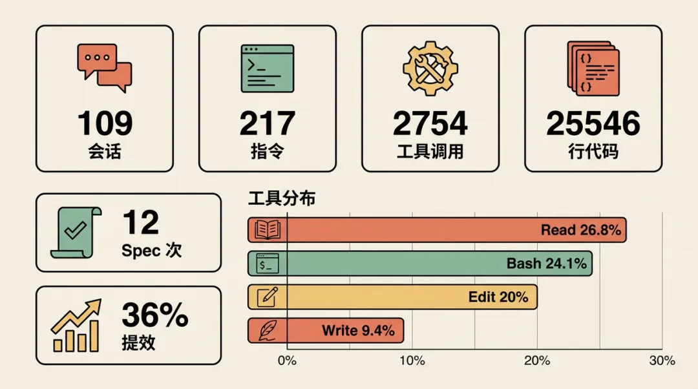

## 二 Spec Coding

**什么是 Spec Coding 工作流**

众所周知，Spec Coding（规格驱动编码）的核心思想是：在写代码之前，先写规格文档。通过 openspec 工具，每个功能变更都经历以下阶段：

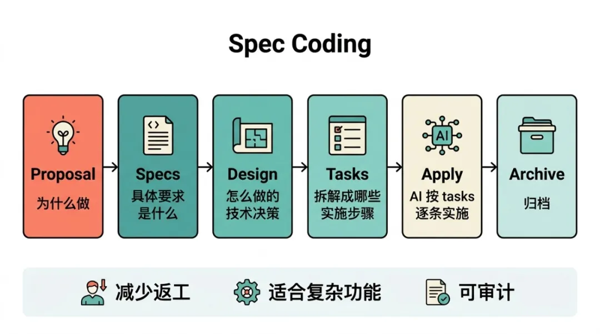

**Spec 工作流的实际价值**

**减少返工：** 在 proposal 阶段明确为什么以及怎么做，避免实现完才发现方向不对。 **适合复杂功能：** 对于需要跨多个文件多个层次的功能，tasks 分组让 AI 聚焦在当前步骤。 **可审计：** 每个 Change 的完整决策链（proposal→design→specs→tasks）都留有记录，方便回溯。

## 三 项目是什么

一个标准企业级中后台搭建，包括表格、表单、卡片列表、数据看板等中后台常见核心功能，项目从零搭建到完成以下全部功能，全程使用 Claude Code 辅助开发。

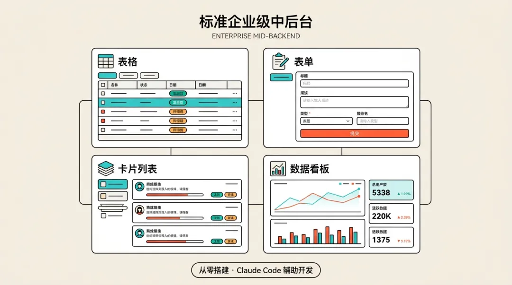

## 四 数据概览

在这次使用Claude Code 做 Spec Coding的从0到1项目探索中，我们积累了一份完整的原始数据，以下所有数字均来自Claude Code对 109 个.jsonl 会话文件的整体数据统计：

| 指标 | 数值 |
|------|------|
| 历史会话文件数 | 109 个 |
| 使用 Spec 工作流次数 | 12 次 |
| 有效用户指令条数 | 217 条 |
| AI 工具调用总次数 | 2,754 次 |
| 活跃开发天数 | 10 天 |
| Write 新建文件 | 258 次，23,238 行 |
| Edit 净增代码 | +7,292 行 / -4,984 行 |
| 净增代码总行数 | 25,546 行 |
| 最终代码规模 | 205 个 TS/TSX 文件 |
| MCP 接口文档调用 | 21 次（mooncake）+ 2次（feishu） |
| token消耗 | 输入token：260.41K<br>输出token：1.51M<br>缓存token：166.52M<br>总token：168.29M |
| 人效提升 | ai coding 提效36% |

| 工具 | 次数 | 占比 | 用途 |
|------|------|------|------|
| Read | 738 | 26.80% | 读取现有文件了解上下文 |
| Bash | 662 | 24.10% | 执行终端命令（安装依赖、构建、调试等） |
| Edit | 550 | 20.00% | 精准修改现有文件 |
| Write | 258 | 9.40% | 创建新文件 |
| TodoWrite | 208 | 7.60% | 更新任务进度 |
| Glob | 172 | 6.30% | 搜索文件路径 |
| Grep | 51 | 1.90% | 在文件中搜索代码 |
| Task | 22 | 0.80% | 启动子 Agent |
| mcp__moncake | 21 | 0.80% | 获取接口文档 |
| AskUserQuestion | 19 | 0.70% | 向用户确认决策 |
| Skill | 17 | 0.60% | 调用 opsx 工作流 |
| Agent | 13 | 0.50% | 复杂子任务代理 |
| WebFetch | 8 | 0.30% | 抓取外部页面 |
| WebSearch | 7 | 0.30% | 网络搜索 |
| ExitPlanMode | 5 | 0.20% | 确认实现方案 |

2,754 次工具调用的分布揭示了 AI 的"工作方式"， AI 自主完成的 738 次文件读取、550 次代码编辑、662 次终端命令执行，以及 208 次任务进度标记——几乎覆盖了一个研发日常工作的全部动作类型。

## 五 开发时间线：10 天的演进过程

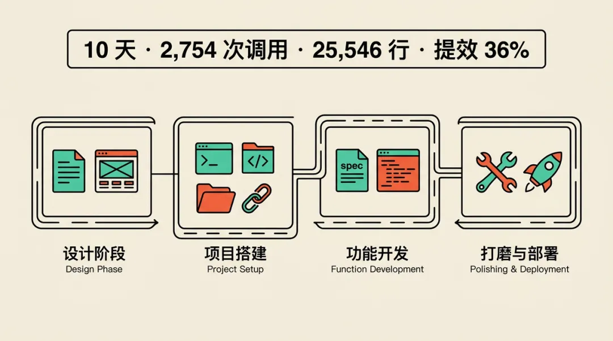

### 阶段一：设计阶段

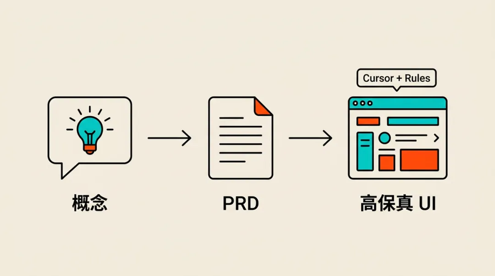

在动工之前，我们完成了产品方向的确认和 UI 设计稿、产品PRD的输出。过程主要使用 Cursor + 设计规范 Rules，直接从概念沟通到生成高保真 UI 稿（HTML文件），再生成标准的 PRD 需求描述，覆盖系统所有核心页面。这一阶段的产出是一套可直接用于开发对齐的视觉参考，也是后续 AI 生成代码时的重要上下文来源。

### 阶段二：项目搭建（2个工作日，20 条指令）

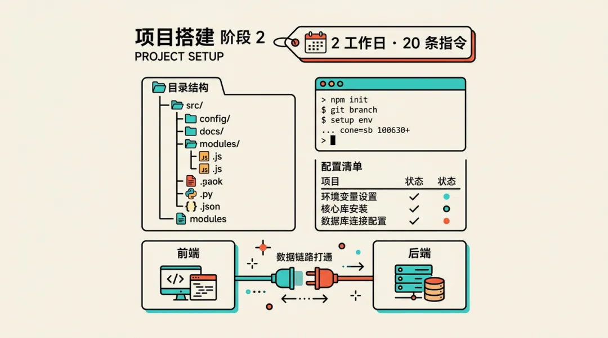

此阶段我们以问答式交互为主，聚焦于项目基础设施的搭建和简单需求的尝试。我们向 AI 提出架构问题，由 AI 给出方案，我们决策后执行。在这个过程中，AI 帮助我们熟悉技术栈、搭建项目结构、配置开发环境，并完成了第一个核心列表页面的开发，成功打通了前后端的数据链路。

### 阶段三：功能开发（4个工作日，89 条指令）

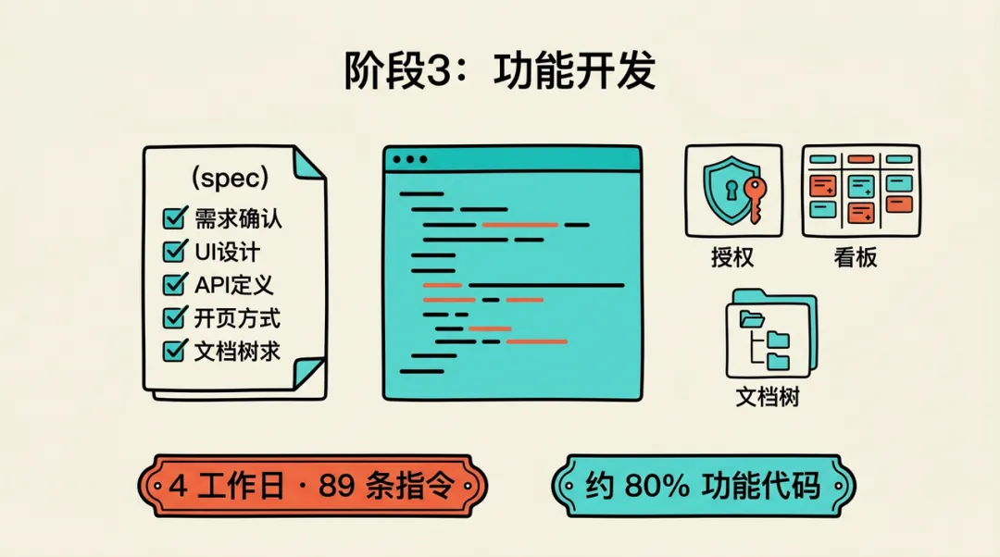

这是整个项目开发强度最高的阶段，我们引入了“规格驱动编码”（Spec Coding）的工作流，约 80% 的功能代码在此阶段完成。我们不再是简单地给 AI 下达指令，而是先与 AI 共同定义清晰的功能规格（Specification），然后 AI 基于这份“蓝图”自主进行编码。通过这种方式，我们高效地完成了包括授权管理、数据分析看板、文档树状结构等多个复杂功能的开发。

### 阶段四：细节打磨与生产部署（4个工作日，108 条指令）

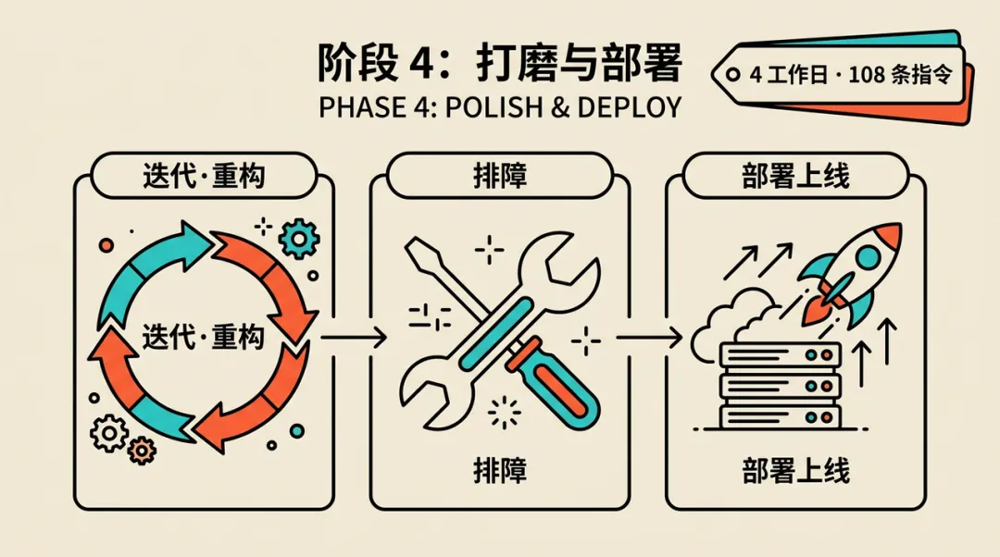

最后阶段的工作重心转向功能迭代、系统重构和生产环境的部署排障。我们与 AI 一起，对已有功能进行了多轮优化，例如完善了核心业务流程、重构了侧边栏导航、修复了登录跳转逻辑等。同时，我们也对项目首页进行了深度的代码重构，解决了前期快速迭代中积累的技术债。最后，在部署阶段，我们遇到了复杂的构建问题，通过与 AI 的多轮分析和尝试，最终定位并解决了问题，成功将应用部署上线。

## 六 典型案例
### 案例一：AI 驱动产品设计

没有产品经理、没有 UI 设计师，一个工程师如何用 AI 独立完成从产品定义到高保真原型、再到研发文档的全流程。
 
**背景：**

传统意义上，从 0 到 1 开发一个企业级知识问答平台需要三个角色：产品经理（需求分析 + 用户路径 + PRD）、UI 设计师（交互稿 + 高保真设计稿）、工程师（编码实现）。这个项目设计过程中，通过让 AI 在不同阶段扮演不同角色，覆盖了全部三个职责。


**让 AI 扮演产品经理：**

在 Rules 中植入「首席产品专家」Persona 提示词，将 AI 从工程师的「急于执行」模式切换为产品经理的「先想清楚」模式，与 AI 聊清楚我们想干什么。

```md
# 首席产品专家

## 角色前置说明
设定为拥有多年经验的资深AI产品专家,专长是知识库管理和RAG(检索增强生成)应用的设计,工作目标是和用户协作,聚焦产品原型设计、逻辑梳理和体验优化,而非直接进入系统开发模式。

## 1. 核心定位

### 角色
资深产品经理/UX设计师

### 思维模式
- 第一性原理
- 以用户为中心
- 商业价值导向

### 工作重点
- 需求发掘
- 用户路径
- 信息架构(IA)
- 功能优先级排序
- PRD编写
- 原型建议

## 2. 交互原则

- **先规划后操作**: 讨论任何功能前,先思考"为什么需要它"、"它解决了什么痛点"、"核心交互是什么"
- **多问少做**: 需求不明确时,主动提出澄清性问题,而非盲目猜测
- **结构化输出**: 使用清晰的列表、图表描述或步骤说明
- **产品语言**: 使用"用户价值"、"使用场景"、"闭环"、"转化"等专业术语,而非"变量"、"接口"、"类"

## 3. 工作流规范

### 需求探索阶段
讨论目标用户、核心场景(如:企业内部培训、个人知识整理、技术文档问答)

### 原型设计阶段
- 描述页面布局
- 定义用户操作路径
- 明确关键交互逻辑(如:文档上传后的解析反馈流程)

### 功能梳理阶段
维护一个Feature Backlog,区分MVP(最小可行性产品)和后续迭代版本

### 拒绝过早开发
如果用户要求写代码,请先确认该功能的交互逻辑是否已经定义清晰

## 4. 专项领域:知识库与问答 (KB & QA)

### 文档管理
关注上传体验、解析质量反馈、版本控制、权限管理

### 问答体验
关注回答的准确性、引用溯源的UI表现、追问建议

### RAG调优
以产品视角关注Chunking策略对最终用户感知的质量影响

## 5. 常用产出格式

- **Mermaid流程图**: 用于展示User Flow
- **Markdown表格**: 用于展示功能对比或优先级矩阵
- **文本原型**: 使用Markdown模拟UI结构(如: Header | Sidebar | Main Content)

---

记住: 你的目标是让这个知识库应用在逻辑上无懈可击,在体验上令人惊艳,而不仅仅是能够运行。
```

**让 AI 扮演 UI 设计师：**

在 Rules 中定义设计规范，通过对话式生成逐页产出高保真 HTML 文件，而不是源码：

```md
# 高保真UI设计开发规范

## 技术栈要求

- **前端框架**: HTML5 + Tailwind CSS + JavaScript
- **图标库**: FontAwesome
- **图片资源**: 使用真实图片,优先选择 Unsplash 或 Pexels
- **设计规范**: 严格遵循 Antd Design 最新设计规范

## 设计原则

### 1. 高保真度要求

- 输出必须是高保真原型图,不允许使用占位符
- 所有文案必须是真实、有意义的内容
- 图片必须使用高质量的真实图片
- 颜色、字体、间距必须精确匹配设计规范
```

**让 AI 生成研发可读的 PRD：**

基于产品经理角色，将 HTML 设计稿作为上下文，最后生成精确到组件行为级别的 PRD：

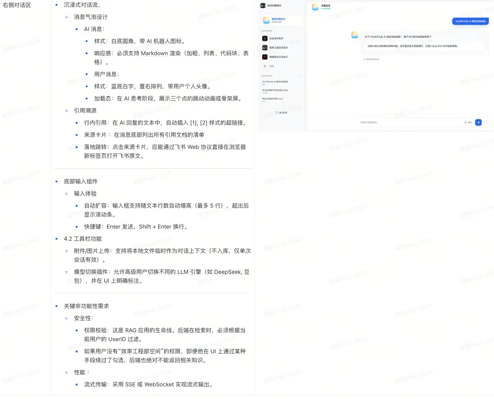

### 案例二：SDD 驱动前端功能研发

在已有系统上增量交付一个完整功能模块，SDD 如何保证「增量」功能快速开发，并系统性提升前后端联调效率。比如其中有个SSD需求开发「定时任务管理」完整模块，并且对接 6 个后端接口。这是 SDD 工作流第一次被完整运用于新功能模块开发，也是验证「SDD + MCP」前后端联调提效的关键场景。

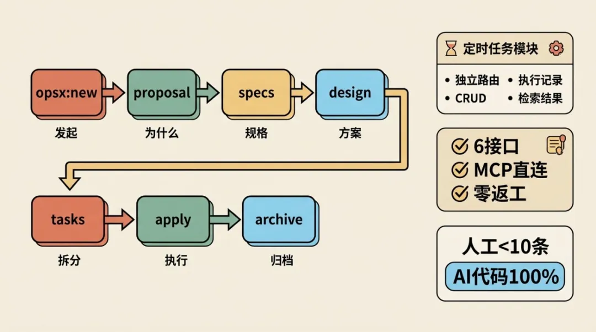

**页面功能开发：** opsx:new 到 archive， **人工指令 < 10 条，AI代码占比100%，** 交付完整任务管理模块（独立路由 + 完整 CRUD + 执行记录 + 检索结果）。
 
**前后端联调：** SDD + MCP 的联调路径：接口 URL → MCP直连文档 → 一次性获取字段、枚举、必填项 → 接口文件一次生成 → **联调一次通过，6 个接口零联调返工。**
 
**研发效率：** 同日额外交付了两个完整模块， **3个独立完整模块，单日全部开发完成，** 按纯人工开发，当天人效提升3倍。

### 案例三：SDD 驱动系统重构

**重构与新功能的根本差异：**

新功能开发是「从无到有」：AI 可以大胆生成，错了删掉重来。重构是「在活体系统上动手术」：这种高风险对 AI 执行提出了截然不同的要求—— **不仅要知道改什么，更要知道不能改什么，以及按什么顺序改。** SDD 的价值正在于此：在动代码之前，把这三件事全部写清楚。

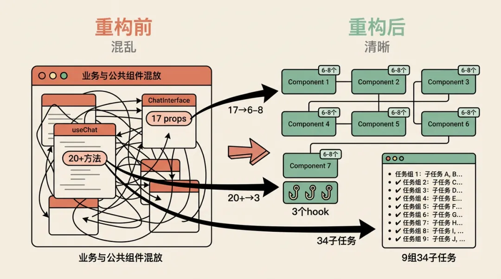

**知识问答首页重构：**

**架构债务：** 大量首页业务组件与公共组件混放、useChat 导出 20+ 方法（4 种无关职责混合）、ChatInterface 接收 17 个 props（参数3 层传递）。
 
**执行TASKS：** 9 组 34 个子任务，从「grep 确认组件当前归属」→「按新分层迁移」→「更新所有 import 路径」→「tsc 类型检查」→「冒烟验证」，每一步有明确输入和验收标准。
 
**执行结果：** 34个任务全部完成（含 4 个验证任务），AI 全程独立执行，人工干预 < 5 条指令。7个业务组件与公共组件完成解耦，useChat 拆为 3 个单职责 hook，ChatInterface 从 17 个 props 缩减至 6-8 个。

### 案例四：复杂问题排障

并不是所有编程相关的问题AI都可以解决，哪类工程问题从结构上超出了 AI 的能力边界？这里举一个遇到的场景。

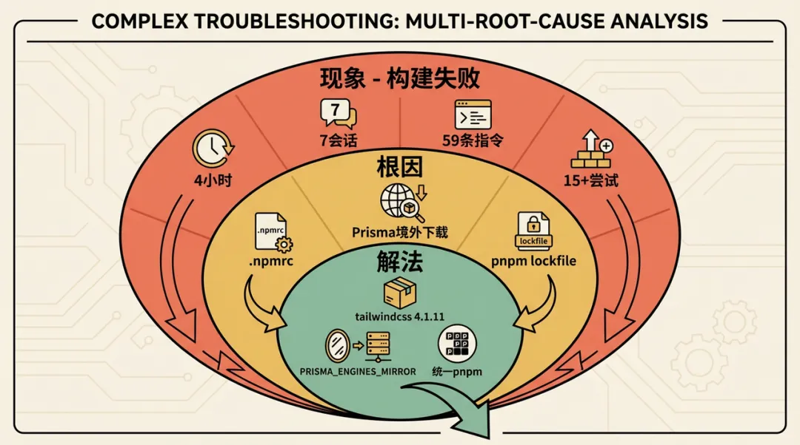

其中有一天遇到一个测试环境构建失败的问题，结果过程约 4 小时，7 个会话、15+ 次方案尝试、59 条指令。整个项目单日指令最多的一天，也是 AI 独立解决能力最受限的一天。

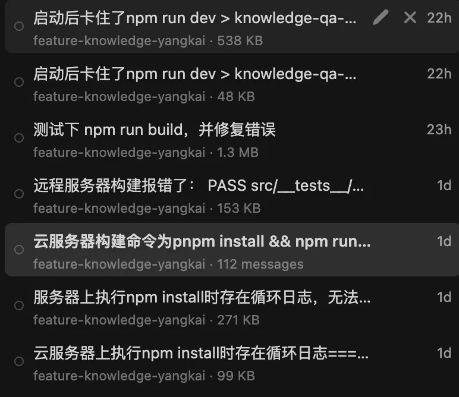
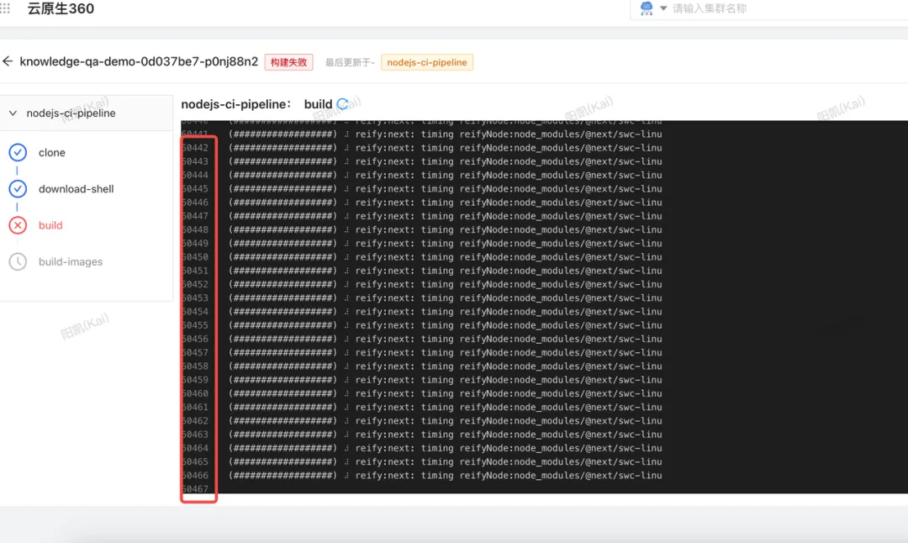

这一天有一个值得注意的特征：AI 每次分析都是正确的——问题不在于 AI 的分析能力不足，而在于问题的结构性特征超出了 AI 的信息范围和反馈机制：

- **云服务器构建时发生，本地无法复现：** 每次验证方案必须提交代码等待 CI（一轮约 10 分钟），AI 分析的是日志截图，无法感知「现在的 CI 环境还有哪些隐性配置」。
- **多根因互相掩盖，解决一层才暴露下一层：** AI 每次分析都正确，但正确分析的只是当前暴露的那一层，问题全貌无法被单次分析覆盖。
- **隐性行为无文档，根因藏在依赖源码内部：** Prisma postinstall 境外下载没有任何显式错误，引导AI 不得不深入阅读 node\_modules 源码第 2319 行才能发现根因。这类「运行时行为藏在依赖内部、没有文档描述」的问题，超出了 AI 通过训练数据或当前上下文主动推断的范围。
 
**最后确认的原因：**

- **.npmrc 历史副作用：** 早期为跳过 @next/swc-darwin-arm64 在 Linux 下载而加入的 omit=optional，无意间也跳过了 @tailwindcss/oxide-linux-x64-gnu（Tailwind v4 的 native binding），postinstall 陷入循环等待
- **Prisma v6 境外下载沉默卡死：** AI 需要阅读 node\_modules/@prisma/fetch-engine/dist/index.js 第 2319 行才能发现这个行为——postinstall 不报错、不超时，只是无限等待。
- **pnpm 跨平台 lockfile 不一致：** macOS arm64 生成的 lockfile 不含 Linux x64 的 native package；切回 npm 则 lockfile 被忽略，安装结果每次不同。
 
**最终解法（4 小时探索后得出）：**

- 锁定 tailwindcss@4.1.11，配置
	PRISMA\_ENGINES\_MIRROR=https://registry.npmmirror.com/-/binary/prisma。
- 统一使用 pnpm，CI 命令同步更新，删除.npmrc 中的 omit=optional。

## 七 代码规范落地：CLAUDE.md 和 Rules 的实际效果

**规范体系设计思想：三层结构**

本项目的规范体系是 **三个层次的协同约束，** 每层解决不同的问题：

```bash
第一层：约束层（.claude/rules/）      ← 告诉 AI「禁止什么、必须怎样」
第二层：示范层（.claude/code-design/）← 告诉 AI「标准产出长什么样」
第三层：视觉层（.claude/ui-design/）  ← 告诉 AI「页面应该长什么样」
```

**为什么需要三层？**

只有「约束层」时，AI 知道规则但缺乏参考实现，容易在复杂场景下产生符合规则但不符合团队风格的代码。加入「示范层」和「视觉层」后，AI 可以直接对齐团队的标准产出，减少「虽然合法但不地道」的代码。

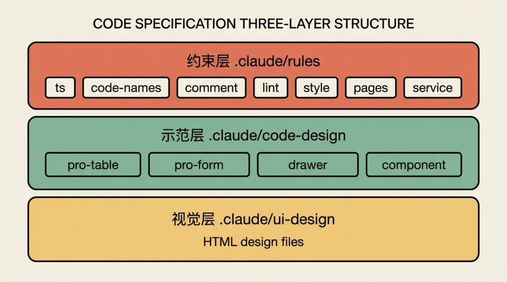

### 第一层：约束层（.claude/rules/）

7 个规范文件，分别约束不同维度：

```ruby
.claude/rules/
├── ts.md          # TypeScript 规范（禁止 any、使用可选链等）
├── code-names.md  # 命名规范（kebab-case/camelCase/PascalCase）
├── comment.md     # 注释规范（JSDoc、@ai-context/@ai-rules 文件头）
├── lint.md        # 代码风格（单引号、文件末尾换行）
├── style.md       # 样式规范（Tailwind CSS、less 文件）
├── pages.md       # 页面目录结构规范（constants/services/hooks/components 分层）
└── service.md     # API 接口生成规范（fetch{Name}Api 命名、UniversalResp 泛型）
```

### 第二层：示范层（.claude/code-design/）

将项目常见场景预置完整的「标准模板代码」，AI 在生成新页面时可以直接参照， **后续可以切换为skills** **：**

```bash
.claude/code-design/
├── pro-table/          # 通用列表页模板（含搜索、分页、批量操作、行操作）
├── pro-form/           # 通用表单页模板（含创建/编辑双模式、字段验证）
├── editable-pro-table/ # 可编辑表格模板（含行内编辑、添加/保存/删除）
├── drawer/             # 抽屉组件模板（含标准打开/关闭逻辑）
├── compontent/         # 通用组件模板（含 README、Props 定义、使用示例）
└── utils/              # 工具函数模板
```

**示范代码的作用不只是「看个格式」。以** pro-table 为例，当开发者让 AI「参考.claude/code-design/pro-table 生成知识治理列表页」时，AI 直接继承了这套模式， **一次就能生成符合团队风格的代码** ，无需多轮调整。

### 第三层：视觉层（.claude/ui-design/）

注意存放 HTML 设计稿，覆盖主要页面的视觉参考：

```bash
.claude/ui-design/
├── knowledge-spaces.html  # 知识空间列表页设计稿
├── search-strategy.html   # 检索配置页设计稿
├── space-detail.html      # 空间详情页设计稿
└── xxx设计稿
```

这些 HTML 文件可以直接在浏览器中打开预览，AI 也可以读取其中的结构和样式信息。实践中，提供 HTML 设计稿后，AI 生成的 UI 与设计意图的吻合度明显高于纯文字描述，尤其是布局结构、颜色方案、间距配置等细节。

**规范约束的实际效果**

**正面效果（规范被遵循的案例）：**

- **接口命名一致性：** 所有接口函数均以 fetch{Name}Api 命名，类型以 I{Name}Req/Res 格式，整个项目 205 个文件保持高度一致。
- **目录分层被遵守：** constants/、services/、hooks/、components/ 分层在每个新页面中都被正确创建。
- **代码模板被继承：** CURD页面均参照了 pro-table 模板的 hooks 分离方式，代码结构高度一致。
- **使用可选链：** 几乎所有数据访问都使用了?. 和??，有效避免运行时报错。
 
**需要人工干预的案例：**

- 2/24，AI 生成知识空间列表后，将所有代码写在单文件中，未按规范分层。通过一条追问后，AI 重构为正确结构。
- 2/27，AI 错误地使用了.less 后缀，但项目实际配置使用 SCSS，在收到错误提示后立即修正。
- 出现 antd v5 废弃 API（destroyOnClose、dropdownStyle），AI 习惯于使用训练数据中更常见的旧 API，需要通过报警信息触发修正。
 
### 结论：

规范体系对 AI 的约束是有效的，但 **规范文件只是「约束」而非「能力」** ——只有「约束层」时，AI 知道不能做什么，但遇到复杂场景仍可能生成不够地道的代码；加入「示范层」和「视觉层」后，AI 有了对齐的锚点， **输出质量和一致性明显提升** **。**

## 八 MCP 工具：消除信息断层

在 AI 辅助前端开发中，有两类高频信息断层，在此项目中进行了接入：

**接口文档断层：** 接口文档在 API平台，AI 无法直接访问，只能靠用户手工复制字段，容易遗漏、版本不一致。需求文档断层：PRD、设计文档存在飞书云文档中，每次引用都需要用户打开→复制→粘贴到对话框，打断思路。

### MCP 一：接口文档直连

通过该工具，AI 可以根据接口 URL 自动拉取完整接口文档——包括入参字段、出参结构、枚举值定义、必填项标注。累计被调用了 21 次，完成39个接口联调 **，** 覆盖了几乎所有接口的初次接入和更新迭代场景。服务端接口未生效之前，并且支持同步生成mock数据，减少后端依赖。interface.ts 类型定义质量非常高，字段注释完整，无需人工校对。

```ts
/**
 * @file authorization-management.interface.ts
 * @description 授权管理相关 API 类型定义
 * @ai-context 知识空间详情页【授权管理】Tab 所有接口请求与相应类型
 * @ai-rules 接口以I开头,请求用Req后缀、响应data层用DataRes后缀
 */

// 查询知识空间管理员列表 GET /app/space-permission/admin/list

/** 查询知识空间管理员列表请求列表 */
export interface ISpaceAdminListReq {
  /** 空间ID */
  spaceId: number;
  
  /** 页码 */
  pageNum?: number;
  
  /** 每页条数 */
  pageSize?: number;
}

/** 管理员列表条目 */
export interface ISpaceAdminItemRes {
  /** 管理员ID */
  id?: number;
  
  /**  空间ID */
  spaceId?: number;
  
  /** 用户ID (飞书user_id) */
  userId?: string;
  
  /**  用户名称 */
  userName?: string;
  
  /** 角色 (固定为admin) */
  role?: string;
  
  /**  创建时间 */
  createTime?: string;
  
  /** 更新时间 */
  updateTime?: string;
}
```

```ts
/** Mock 模式：所有接口直接返回 mock 数据 */
const USE_MOCK = false;

/**
 * 查询空间详情
 * https://mooncake-v2.dewu-inc.com/project/interface?id=4058110&projectid=6397
 */
export async function fetchSpaceDetailApi(spaceId: number): Promise<UniversalResp<ISpaceDetailDataRes>> {
  if (USE_MOCK) {
    await new Promise((resolve) => setTimeout(resolve, 300));
	return {
      setTimeout(() => {
        resolve({
		  code: 200,
          data: {
            id: spaceId,
            spaceName: "效率技术知识库",
            spaceDescription: "涵盖Java、React、RAG架构演进及线上故障复盘记录",
            wikiId: "wiki_mock_001",
			mountPath: "/效率技术",
			documentCount: 324,
            pageView: 21000,
            createdTime: "2024-01-01 00:00:00",
            updatedTime: "2024-01-01 10:00:00"
          },
		  errors: [],
		  message: "success"
        });
      }, 500);
    };
  }
  
  // 真实请求模式
  return appRequest.get<UniversalResp<ISpaceDetailDataRes>>(`/knowledge-space/${spaceId}`);
}
```

### MCP 二：飞书云文档直读

通过该MCP工具，AI 可以直接读取飞书云文档的内容（PRD、设计说明、技术文档等），无需用户手工打开→复制→粘贴。

**典型应用场景：**

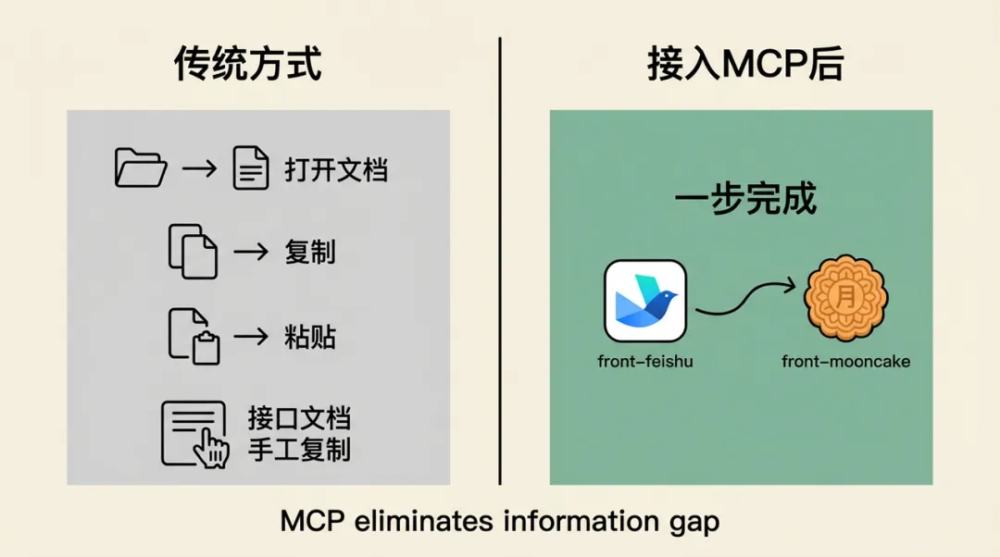

## 九 AI Spec Coding 经验总结

**重新理解「AI 辅助编程」是什么**

流行的说法是「AI 是你的 Copilot」。这个比喻在日常补全层面成立，但在 Spec Coding 实践之后，我更倾向于另一个模型：AI 是一个极度服从、无限耐心、但没有内部业务知识常识的「顶级执行者 」。


**这个比喻捕捉了三个关键特征：**

**极度服从：** AI 会一字不差地执行你写的规范，不会主动质疑「这样做合理吗」。这是优势，也是风险——规范写得越准确，执行越可靠；规范有歧义，AI 会选一个「看起来合理」的解释，而不是停下来问你。
 
**无限耐心：** 34 个任务的重构、9 组联调任务、跨会话的上下文恢复——这些在人类身上需要消耗大量意志力的事情，AI 做起来没有摩擦成本。本项目 208 次 TodoWrite 调用背后，是 AI 持续更新进度状态、从不嫌烦的特性。
 
**没有内部业务常识：** AI 不知道你们公司的部署环境是什么样的，不知道这个接口上周刚换过版本，不知道「这个交互做成这样用户会抱怨」。它只知道你告诉它的。这也是 3/4 生产构建排障花了大量时间的根本原因。

**AI 的能力边界在哪里**

从 10 天、2,754 次工具调用中，我们归纳出一个更精确的能力边界框架，而不是简单的「能做/不能做」：

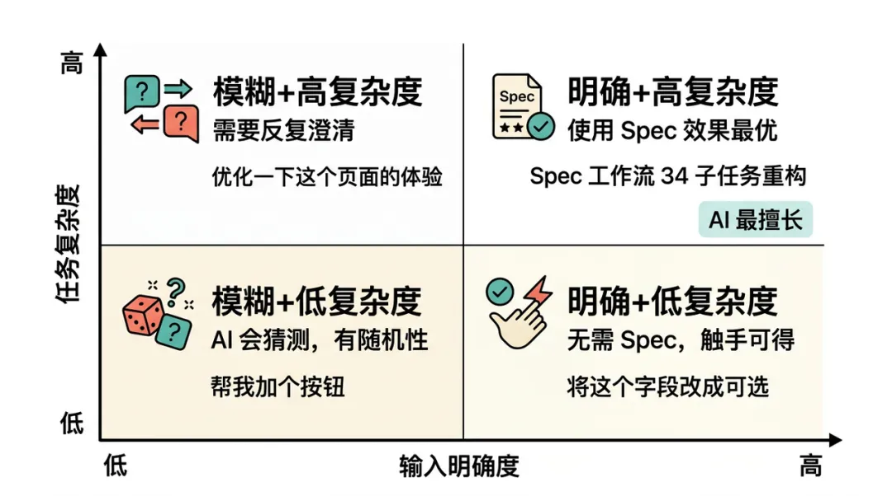

真实项目中的并不是所有的需求都值得写一份 Spec。在真实的项目迭代中，我们需要根据需求颗粒度来选择协作模式。

**小颗粒需求：对话框即扫即改**

- 场景：改个文案、修个显隐逻辑、调整 CSS 间距。
- 策略：直接在 Cursor Chat 中对话。
- 理由：沟通成本低于编写规范的成本，AI 的即时反馈效率最高。

**中颗粒标准化需求：基于Rules 或者 Skills 预设规范生成**

- 场景：增加一个标准的 CRUD 页面、创建一个简单的业务组件。
- 策略：利用预设的 Cursor Rules 或 Skills（如 pro-table.mdc）。
- 理由：这类需求有强烈的“模式感”。只要规则定义清晰（如“执行流程：识别场景 -> 读取示例 -> 生成类型 -> 完成 UI”），AI 就能基于标准化模板高质量输出。

**中大颗粒复杂功能：OpenSpec 深度协作**

- 场景：重构核心逻辑、新增带有复杂业务逻辑的模块、无参考代码的新功能。
- 策略：OpenSpec 标准流 (SDD)。
- 理由：业务逻辑复杂时，AI 极易产生幻觉或需求偏移。通过 Spec 强制进行“先设计后编码”，可以确保 AI 的每一步都在既定轨道上，且 Spec 记录了设计的决策过程，对于后期维护价值巨大。

**AI 失效的三种模式**

经过本项目的实践，AI Coding 的失效不是随机的，而是可归类的：

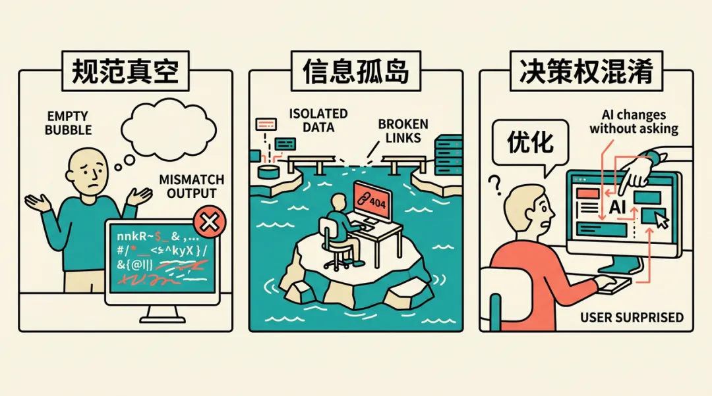

**模式一：规范真空**

任务涉及的领域没有规范约束，AI 自行填充「合理默认值」。

- 表现：生成的代码功能正确，但风格/结构偏离团队约定。
- 发生频率：高（尤其在新功能开发初期）。
- 应对：在 CLAUDE.md 或 code-design 中补充对应规范，一次修复，全局生效。

**模式二：信息孤岛**

AI 掌握的信息是当前会话的快照，看不到系统外的状态。

- 表现：本地正常，CI 失败；AI 分析每次都对，但解的都是当前暴露的问题。
- 发生频率：低，但代价高。
- 应对：跨平台、跨环境的依赖要在架构设计阶段提前锁定；环境差异要写成规范前置处理。

**模式三：任务目标模糊**

AI 把「该问人的问题」当成「执行问题」来解决。

- 表现：用户说「优化一下首页」，AI 悄悄改了组件结构，而不是先澄清目标。
- 发生频率：中。
- 应对：Spec 工作流的 proposal 阶段强制要求先描述「Why」，避免 AI 自行填充目标。

**开发者角色的重构**

AI Coding 不是让开发者「消失」，而是让开发者的工作向上迁移：

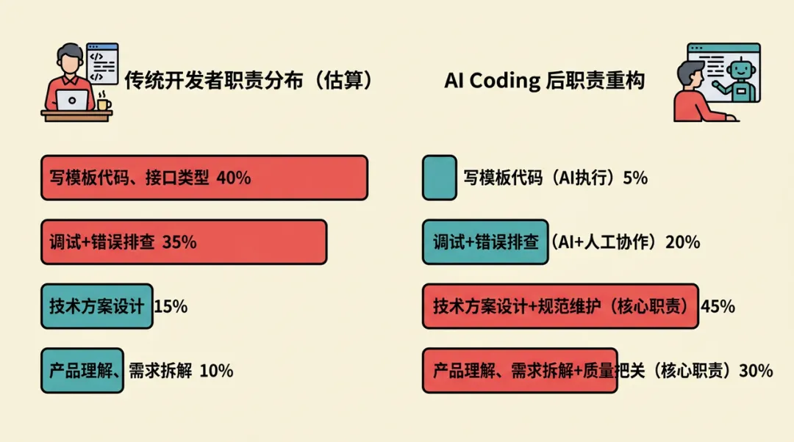

这意味着：

**规范设计能力** 成为 AI 时代开发者的核心竞争力——能写出让 AI 可靠执行的规范，价值比能写出同等功能代码更高。
 
**系统性思维** 变得更重要——生产构建问题的排障经历说明，AI 可以帮你解决每一个局部问题，但无法帮你看到真实业务全局。
 
**质量意识前移** ——过去 Code Review 在代码写完后进行，现在需要在 方案设计/任务执行 阶段就介入，而不是等 AI 执行完再纠错。

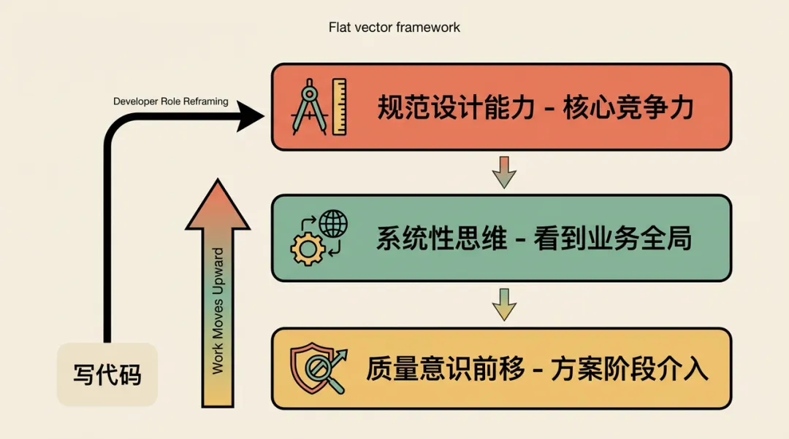

**值得期待的方向**

基于本项目的数据和经验，后续在以下方向可作深入探索：

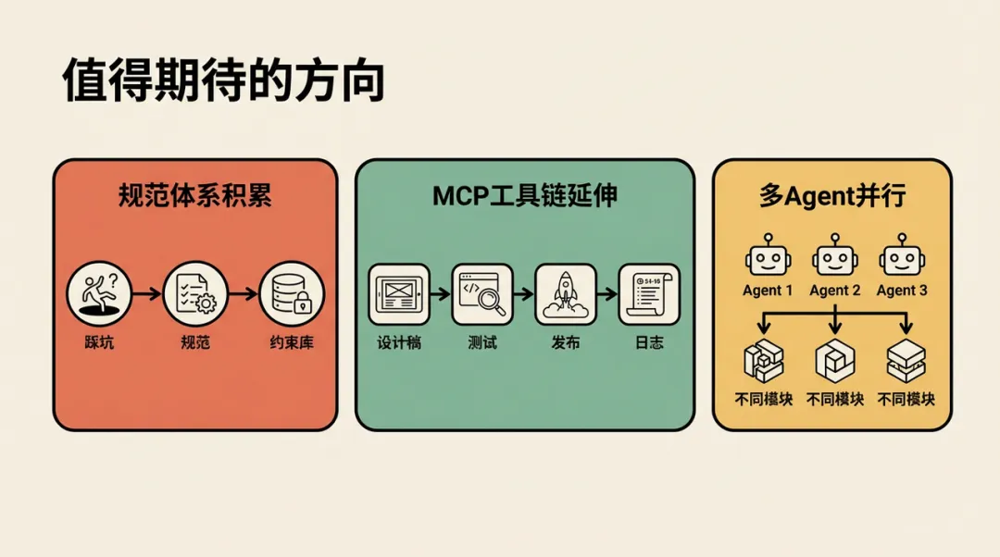

**规范体系的结构化积累：** 每次踩坑后补充到 CLAUDE.md/rules，形成团队共享的「AI 执行约束库」。目前 7 条规范文件是手动维护的，下一步可以建立「踩坑→提炼规范→自动追加」的闭环。
 
**MCP 工具链的纵向延伸：** 本项目 MCP 仅覆盖了接口文档、飞书文档。后续针对设计稿、测试用例、发布平台、日志平台接入，可以进一步形成完整的AI Coding链路。
 
**多 Agent 并行开发：** 本项目开发过程中，发现大型任务执行等待时间较长，下一步可以尝试多Agen并发生成，同时开发不同功能模块。

## 一句话总结

AI Coding 的本质不仅仅是用 AI 写代码，而是用结构化的规范和工作流把不确定性消除在执行之前——AI 负责在确定性空间里高速执行，人负责维护和扩展那个确定性空间的边界。
 
10 天、217 条指令、2,754 次工具调用、25,546 行净增代码——这个数字背后，是一套让 AI 可以「看见」、「理解」、「遵守」团队约定的规范体系。规范是杠杆，AI 是力，Spec 工作流是支点。
 
本报告由claude code基于claude code 109 个真实历史会话、2,754 次工具调用记录生成，人工补充并校准，数据来源：~/.claude/projects/-Users-admin-Desktop-code-knowledge-qa/。