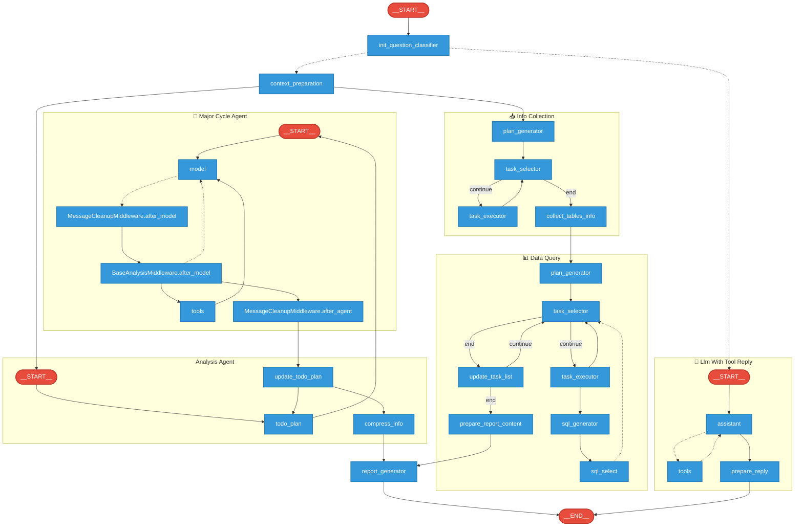
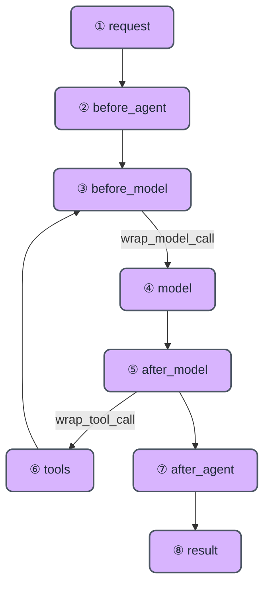
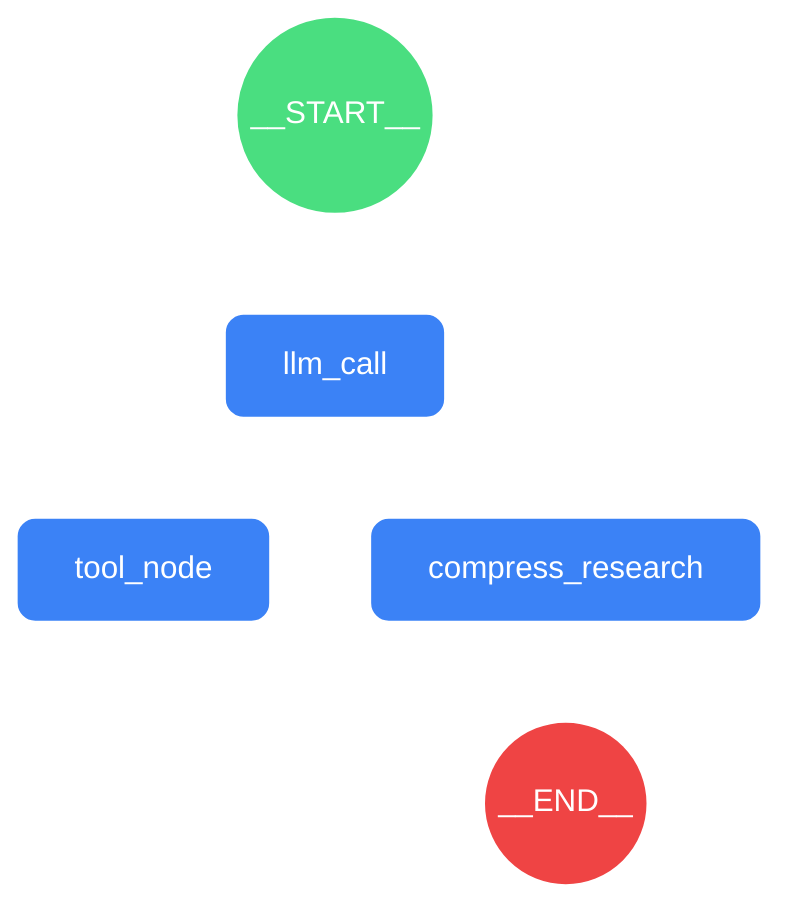

# 游戏数据分析Agent的全栈架构演进

> - **Published:** 2026-03-06
> - **Source:** [游戏数据分析Agent的全栈架构演进](https://mp.weixin.qq.com/s?__biz=Mzg3Njc0NTgwMg==&mid=2247504028&idx=1&sn=cb78fb155cef1df7bc5447a34b74fab1&poc_token=HKxCummjsCItsnvDW8FTCk2amIueQiLHFqmdGVR8)
> - **Tags:** `Agentic Engineering`

**前言**

写在前面，由于现在LLM生成内容千篇一律，作者尽量自行撰写核心内容，LLM仅限于润色优化，争取把整个开发迭代历程完整呈现出来供学习交流。

**一、背景与挑战**

游戏业务随着持续深化，各个岗位对数据的诉求也越来越深入，但游戏数据分析需要结合极强的领域知识和数分技能，具备较高的门槛。

伴随着LLM的能力增强，如果能结合个人多年游戏业务的分析沉淀，将较为通用的分析方法论融入其中，从而帮助到部门同事深化对数据的理解和使用。

实际立项以后，发现也有诸多的挑战和难点等待被攻克。

**主要技术挑战和难点**

- 游戏业务日常具备海量的‘黑话’、‘术语’、‘概念’等等，如何真实理解部门业务同事的独有诉求？
- LLM 生成的‘不确定性’与数据查询对‘确定性’的高要求之间的矛盾，如何保障查询结果的准确性？
- 探索游戏数据问题往往需要多种技能，如何让agent自行实现游戏数据分析？
- 粒度的权限管控挑战，如何在 Agent 中通过自然语言处理复杂的企业级数据安全要求？

**二、架构演进之路**

整个开发过程中，前前后后实际作者上做了完全不同的3版方案，整个演进过程如下：

**v1.0 (LangChain Chain)：线性执行的**

**局限性，无法处理追问和复杂错误恢复。**


初步实现的效果如视频所示（备注：视频演示为测试数据）

**需求目标：** 单一固定场景--实现SDK转化漏斗的自动异动分析

**技术选型：** 基于LangChain(0.x版本)

**开发工具：** Cursor（Claude 3.7 Sonnet）

**选型理由：**

异动分析是一个较为固定的开发流程，考虑到实现，最终参考大模型给出的技术选型建议，采用了 LangChain 的链式编排。当时设计了6个步骤：

1. 最新数据读取 → 2. 直接分析(简报) → 3. 分析方案制定 → 4. 分析代码生成 → 5. 代码执行 → 6. 结合产物做深度分析(报告)

**主要卡点：**

整个链路成功率每一步成功率都不高(产物传递和使用与预期不符)，修改困难，彻底重写了3次也未解决（如下文档），受限于当时的模型能力和框架能力，即使使用TDD开发也无济于事。

```md
# AutoDataAnalysis Agent V3

## 🚀 模块简介

基于 LangChain 框架的自动化数据分析系统

- **代码生成可靠性低**: 通过多层验证机制确保生成代码的准确性
- **执行结果质量不稳定**: 引入结果验证和质量评估模块
- **结果传递困难**: 统一数据接口,实现无缝结果传递
- **调试效率低下**: 提供可视化调试界面和日志追踪

## 🔽 架构概览

系统基于 LangChain 的 SequentialChain 架构,采用以下链路流程:

数据读取 → 2. 初步分析(简报) → 3. 分析方案制定 → 4. 代码生成 → 5. 代码执行 → 6. 深度分析(报告)


主要模块包括:

- **core**: 核心框架和基础功能实现
- **analyzer**: 数据分析引擎
- **settings**: 配置管理系统
- **data_processors**: 数据处理模块 [详细文档](./data_processors/README_DATA_PROCESSORS.md)
- **artifacts**: 结果管理模块 [详细文档](./artifacts/README_ARTIFACTS.md)
- **validators**: 数据验证工具
- **executors**: 代码执行环境
- **reporters**: 报告生成器
- **debugger**: 调试和日志系统
- **api**: API 接口层
```

**失败总结：**

1. 对Agent定制开发的工程化工作量严重低估且当时对Vibe Coding盲目自信，误以为Vibe Coding可以实现一切需求，自身忽略对实现代码的关注

2. 缺乏对LLM相关框架库的深入了解，无法人工debug，且不知道LangChain(0.x版本)自带的框架范式已经落后

（备注：官方于2025.10.22发布重写后的1.0版本，只是名字沿用但已彻底重构）

***最新现状：***

*此场景已经在v3架构上重写并运用于线上重点游戏转化率和指标监控*

 

**v2.0 (Dify Workflow)：低代码的瓶颈，**

**业务逻辑定制化困难。**


**需求目标：** 实现一个基于LLM的数据部对话机器人，实现简单的知识问答和直接的搜索查询

**技术选型&开发工具：** Dify（发音为"滴菲"）

**选型理由：** 自带Rag和权限管理模块，开发简单迅速，快速上线MVP，其他同事也可以共同协作（甚至包括非技术同事）

**主要卡点：** 随着持续迭代，工程项目复杂度已经难以维护（均在海量硬编码，复杂逻辑支持麻烦），调试困难（缺乏详细日志，同时Dify黑盒了不少逻辑），且开发自由度高度受限（部分上下文框架自采集，难以定制修改），基本已达项目诉求的瓶颈

 

**失败总结：**

1. 由于Dify是低代码可视化节点编程，项目复杂度过高时，节点编程边际收益逐渐走低

2. Dify也是比较新的项目，bug和功能也不够完善，开发过程中遇到了多次问题还提了git issues

3. 仍有比较有价值的收获，掌握了Dify的插件开发能力（甚至帮友商优化了官方开源插件）


***最新现状：***

*由于方便上手的特性，目前部门其他同事会针对一些简单场景使用Dify开发落地，比如落地上线一些简单的Agent归因分析产品*


**v3.0 (LangGraph)：直面底层设计，**

**图与状态的引入与定制。**

**技术选型：** LangGraph + Dify(知识库&前端包装)

**开发工具：** Cursor(IDE) + CC + CodeX 三持

**选型理由：**

目前Agents框架主要分为两大类：

| 维度 | 拟人协作类 | 流程控制类 |
|------|------------|------------|
| 核心隐喻 | "团队"(Team & Roles) | "大脑"(Brain & State Machine) |
| 控制方式 | 角色扮演，依靠Prompt引导协作 | 显式定义结构和状态流转 |
| 确定性 | 低(Conversation-driven) | 高(State-driven) |
| 复杂度上限 | 适合发散性、创意性任务 | 适合长链路、高容错、逻辑严密的工程任务 |
| 调试难度 | 困难(像调试一段对话) | 可控(像调试一段代码，支持Step-through) |
| 典型适用 | 创意写作、开放式头脑风暴 | 企业级业务流、数据分析、代码工程 |
| 代表框架 | AutoGen、CrewAI等 | LangGraph、Llamalndex等 |

选取LangGraph的主要考量：

1. 个人层面：通过了官方的LangGraph认证，理解其核心代码实现，对其能力上下限有一定把握

2. 框架层面：由于之前的教训，对框架的“可控性”和“观测性”有较高的优先级，LangGraph自带企业级3件套（开发、调试、部署平台）

3. 应用层面：知名科技大厂使用LangGraph开发生产级应用，比如Uber、LinkedIn、Elastic、Google等


最终执行实现的效果：


**三、核心工程实践**

首先明确几个LangGraph概念，这里作者就从更方便理解的角度去描述，更具体的可以查看官方文档：

➢ Graph - 图，本质就是一个Agent/Agents的执行流图，或者说状态转移图

➢ State - 状态，它是一个随执行流转而不断演变的共享数据结构

➢ Node - 节点，实际的逻辑执行

➢ Edges - 边，决定了信息(State)的流向

➢ Threads - 会话线程，就是用户的一个对话窗，可能包含多次与AI的交互（也就是多个Runs）

➢ Runs - 一次Graph的执行，也就是与Agent的单次交互

接下来将详细开展工程化细节

**1.整体Graphs设计(Agent)**

先来看下Multi Agent的常见架构：


<sup>(图片取自LangGraph官方文档)</sup>

| 架构类型 | 控制方式 | 灵活性 | 主要特点 |
|----------|----------|--------|----------|
| 网络架构<br>(Network) | 去中心化(人人平等) | ★★★★★ (极高) | 自由协作，无中心节点 |
| 监督者架构<br>(Supervisor) | 中心化(单一主管) | ★★★ (中等) | 任务由主管明确分配 |
| 工具调用架构<br>(Supervisorastools) | 动态选择(视作工具) | ★★★★ (高) | LLM 自主判断调用哪个"专家" |
| 层级架构<br>(Hierarchical) | 多层级(树状结构) | ★★ (较低) | 适合处理极其复杂的企业级任务 |
| 自定义工作流<br>(Custom) | 混合模式 | ★★★ (可变) | 按需定制，结合以上所有 |

其实Multi-Agent本质上就干两件事： **上下文隔离** 与 **控制权转移**

所以本项目采用的方案更像是Custom自定义的模式。

**当前本项目的Graph架构设计是：**



Graph整体上分为几块：

- 初始主控路由分配器，会基于任务类型来做不同粒度的Agent分发（实际上有3条线）
- 第一条线-简单回复和HITL（最右侧）：简单的追问回复、信息查询、知识库读取等小任务（不涉及实际数据查询，单次tool_call），快速响应
- 第二条线（中间）：固定式数据查询任务，整体流程上是基于单次查询即可得出的简单任务（比如B游戏上个月的DAU情况），整体分为“找所用表->查询”两步
- 第三条线（最左侧）：基于Agent Loop的数据分析Agent，用于处理探索性数据分析任务。

其中第三条线是本项目最关键的上下文工程落地案例，整体上这个SubGraph的结构为：TODO 规划 + ReAct 循环。

这么设计主要考虑到tokens和时间消耗的折中，同时对各个环节进行解耦，方便后续持续的重新调整组合。

**2.领域知识的“动静结合”**

由于数据分析业务场景一定包含了大量的私有领域知识，所以知识的录入对上下文来说非常重要。这里知识来源主要分为两类 **静态知识** 和 **动态知识** 。

**静态知识：**

针对查询的基础通用知识，比如ODPS SQL写法等内容，作为长期不变的内容，目前是通过硬编码在相关LLM请求的SystemPrompt中，更新迭代随着版本再变化。

这类知识目前采用“ **结构化提示词(Structured Prompt)** ”方式进行撰写，关于结构化提示词：

```markdown

1. 不同的模型针对Markdown和XML等结构会有额外的微调，比如claude官方表示他们针对XML做过微调。
2. 结构化提示词就是为利用更加具有逻辑结构的描述，来提高LLM的生成效果，实践效果经过海量的认证。
3. 结构化提示词示例（参考LangGPT）：
'''
# Role: 你是一个游戏数据分析师

## Profile
- Author: 小B
- Version: 1.0
- Language: 中文
- Description: 清晰的角色描述和核心能力

### Skill-1
1. SQL查询
2. 具备查询公司数仓表的能力

## Rules
1. 在任何情况下都不要编造不是查询结果的数据
2. 严格遵循Hive SQL的语法逻辑

## Workflow
1. 分析用户输入并识别意图
2. 系统性地应用相关技能
3. 提供结构化、可操作的输出

## Initialization
作为 <Role>，你必须遵守 <Rules>，你必须用默认 <Language> 与用户沟通，你必须严格遵循 <Workflow> 流程来完成用户需求。请先介绍一下自己的能力范围。
'''
```

**动态知识：**

**1. RAG-专有知识库**

由于已经上线了Dify平台，知识库则正好可以依托于的已经部署完成的Dify来共同管理。

项目所用的知识库主要分为以下几类：

1. **游戏别名：** 由于同一游戏在业务侧有非常多的叫法，所以对齐游戏称谓是最重要的一件事

2. **游戏基础信息：** 游戏相关信息的完整表，包括game_id、上线时间，渠道id等关于该游戏的一切基础信息（通过上游多张表预加工合成，定期更新）

3. **指标规则解释：** 针对日常数分领域常用的指标，对应的介绍、计算方式、维度等信息

1. **专业术语解释：** 一些额外的游戏业务专业术语、黑话

5. **历史查询案例：** 数分同学的经典任务case，包含简要描述和对应的SQL语句

**知识预处理：**

项目的知识库本身都是经过结构化预处理的，主要有以下几步，整体上类似特征工程：

1. 数据清洗(Data Cleaning)，一些异常值剔除、缺省值处理等，比如移除没有上线的游戏，或者已经下线的游戏信息

2. 重聚重塑(Data Reshaping)，比如游戏A不同地区在原始表中是有多条记录，可以对内容做Pivot（如下图将渠道进行降维）

3. 数据格式化(Data Formatting)，合理切分知识内容并转换为表格，从而做到对文档分块时0冗余

实测经过处理以后的知识库，响应的召回率和准确率都有显著上升，比尝试单纯优化Embedding/召回算法带来的收益高得多

**2. 注入-场景独有知识**

基于场景进行设定的一组Prompt集合，根据不同的key来主动注入给Agent运行的上下文，从而作为追加的Prompt内容，选择性的替换，以应对不同业务下分析路径差异。比如SDK漏斗分析Agent，就是通过配置对应的场景内容，实现了自动深度分析功能。

场景知识主要分为这3个类型：

- 该场景探索的补充知识 - 对应业务独有的数据分析探索路径，比如先细拆a维度，或者先看同环比等
- 该场景SQL执行注意事项 - 针对特定业务可能存在一些独有编写注意事项，比如分区格式、时区要求等
- 该场景的常用表 - 给与Agent一些对应业务相关表信息，避免其发散式的探索。

**3.状态管理**

Agent开发的设计哲学，就是把一切“必须稳定保存且可被模型读取”的信息抽象成结构化State，并且随着Agent执行进行“有序累积”。

State承担了Agent运行时的上下文核心关键，记录了运行过程中的所有原始信息，并能够随时修改合并，每一次请求的Prompt构成均基于State中存在的信息进行提炼，从而确保了可以每轮对话根据实际需求动态拼接应有的完整Prompt。

LangGraph对State的设计非常巧妙，每一个节点实际上都是一个独立的State实例，节点到下一个节点时，又copy(或合并)了一遍所有参数，从而实现了Checkpointer快照，也解耦了Node之间的上下文，这会带来好几个好处，后续将展开讲解。

本项目的State主要由以下几类构成：

- **权限与身份：** 记录当前运行的角色权限模型实例相关
- **查询上下文：** 数据分析执行的各种上下文原始数据，包括查询语句及对应的查询结果dataframe等
- **业务知识注入：** 前述场景RAG结果和领域知识的原始文本
- **任务/TODO管理：** Agent执行过程中的TODO管理
- **执行约束：** 执行计数情况
- **报告拼装：** 撰写报告用的提炼内容
- **SubAgent上下文：** SubAgent启动时的上下文及结果返回

针对State处理有2个关键机制实现：

1. **自定义合并函数** 由于LangGraph默认的State是采取覆盖的方式，所以针对一些复杂结构需要编写自定义合并函数，以处理上下文传递时的State合并事件，比如任务列表会根据'task_id'进行覆盖或添加操作。

2. **上下文转字符串** State字段均编写了快速转换为String的函数，以便开发时迅速拼接所需的Prompt。

**4.上下文工程详细展开：**

**基础知识**

很多没有真实做过Agent开发的朋友是否想过一件事，就是大模型如何知道你的追问的？

其实很简单，就是在Prompt中增加关于历史对话的描述，比如发送给LLM的伪代码示例：

```python
dialogue_prompt = """
你与用户的历史对话为：
Human：你好，我叫小B。
AI：小B你好，很高兴认识你。
Human：我叫什么？
"""

# 这里在最新的用户对话前面追加了关于历史对话的说明
response = llm_client.invoke(
            HumanMessage(content=dialogue_prompt + human_prompt)]
        )
print(response.content) 
# AI由于已经知道了之前说的内容，所以能正确回复出“小B”。
```

这就是最基础的Context Engineering例子，仅仅加了一段“历史对话”的文本内容，从而实现了‘多轮对话’的能力！

Context Engineering说白了就是在 **合适的时机** 传入 **恰到好处的上下文内容** ，从而引导出 **正确的响应内容** 。

**Prompt构成**

由于分析Agent部分基于Agent Loop，实际上是在进行内部的多轮对话（HumanMessage、AIMessage、ToolMessage等），因此先来看一下本Agent的Prompt构成（每轮对话的Prompt构成）。

User Prompt主要通过XML进行结构化分区设计（这里的User Prompt并不是真的用户，而是每轮loop时给llm的动态Prompt内容，区分于SystemPrompt），主要有以下几个分区：

- <用户问题背景> - 包含用户最新的对话问题、历史对话等信息
- <已有的游戏信息> - 提前查询到的问题相关游戏基础信息，包含最关键的game_id等枚举值
- <指标规则参考> - 对于本次问题的指标解析信息
- <TODO状态> - 管理todo list，包含todo内容、todo状态和结果摘要
- <当前历史执行情况> - 过去的SQL查询执行情况
- <最近反思> - 对于过去一段时间的自我反思内容
- <同期运营活动调研> - 游戏对应的同期运营活动信息

出于对tokens的最大节约且执行的任务类型偏固定，所以在整体设计上采用每轮对话重新整理Prompt，所以上述User Prompt会在每一次Agent Loop时进行生成，但一般更常见的方式为 **Messages** 队列达到特定阈值时进行一次内容压缩。

**ReAct架构实现**

针对每轮Agent Loop的设计，整个执行架构使用的是中间件模式去处理



```apache
1 - 用户问了一个问题，request一次请求进来
2/3/5/7 - 分别的执行生命周期切入点，其中2/7只会执行一次，Middleware包装可以重写任何生命周期函数从而对State进行逻辑编写。其中当5的最新一条消息不为tool_call时则会跳转到7的结束环节，准备返回给用户信息。
4/6 - 分别是AIMessage和ToolMessage响应前的包装器，可以完全控制调用时的参数（包括修改请求时的Prompt）和返回的结果
8 - 返回给用户的AIMessage信息
```

允许编写任意多个Middleware（每个Middleware可选实现一些生命周期函数），比如一个MiddlewareA和MiddlewareB都可以实现'before_model'和'after_model'函数，然后会根据传入的Middleware顺序根据洋葱模型执行：

1. MiddlewareA.before_model

2. MiddlewareB.before_model

3. model

4. MiddlewareB.after_model

5. MiddlewareA.after_model


*<sup>(图片取自网络)</sup>*

从而实现不同Middleware专注于特定的逻辑任务，实现了良好的可扩展可维护性。

**Tools设计**

实际上Context Engineering很大程度上是对工具调用的结果做信息压缩和筛选。

主要包括工具本身的调用设计和工具结果的信息提炼，基本是每个工具都有对应的一个或者多个Middleware。

另外作者设计工具的大原则是只设计必要的工具，控制工具数量和控制参数，工具名之间避免歧义，从而减轻llm认知负荷。

另外根据langchain官方的实验结论：

```cs
- Llama 3.18b fails with 46 tools but performs better with 19 tools
- Dynamic tool selection improved Llama 3.18b performance by 44%
```

让我们先来看本项目的 **工具设计选择** 及对应 **上下文工程细节** ，这里选择比较重要的展开：

**search_available_tables_tool**

说明：表搜索工具，基于表名、表描述等信息的文本匹配搜索

State包含：无State长期留存内容，属于临时查询

上下文工程：

- 自动适配三种权限场景：game_auth 本地白名单、用户自带 ak/sk、默认管理员全表模式。

- 会自动从知识库、数据地图(封装OpenAPI)分别搜索命中的表，会将表名和简述加工成Markdown列表告知模型

**table_info**

说明：表明细信息查询工具

State包含：当前thread历史查询表的详细信息

上下文工程：

- 提取关键信息 表结构+分区+注释+上游任务名

- 会附上最新分区的 3 行预览作为参考（实测有预览数据情况下，SQL生成成功率会显著提高）

- Prompt 注入时统一拼成 `<TablesInfo>` XML

**table_lineage_relationships**

说明：指定表的上游血缘表和ETL SQL信息

State包含：无State长期留存内容，属于临时查询

上下文工程：

- 封装数仓OpenAPI相关血缘查询接口

- 原始 ETL SQL 会做压缩，随后由 LLM 提炼为“上游表关系”的摘要信息。

**sql_tool**

说明：查询能力，兼容用户aksk，多区域自动识别，还支持临时表的DDL

State包含：当前thread每一次查询的任务名、SQL语句、查询结果、查询总结、对应datalayer变量名

上下文工程：

- SQL查询后，会先对语句做语法级压缩后再保存到State，然后结果交由 LLM 生成“详细总结 + 一句话总结”。

- 结构化写入<SQLTask>：`description/sql_code/sql_result/summary/summary_one_line/datalayer_variable`。

- Prompt 侧采用分层回放：最近 3 条包含完整结果；4-10 条仅 summary；更早仅 one_line，避免上下文爆炸。

- 支持 `get_sql_task_detail_tool` 按需拉取历史完整结果。

- SQL查询结果的DataFrame，会自动注册到datalayer，仅传变量名而不是整表内容。

**think_tool**

说明：No-op函数，工具描述会引导AI强制自我反思一次

State包含：最近一次反思的内容

上下文工程：

- 强制“思考-反思”节点，逼迫模型在继续执行前进行决策复盘，参考开源的OpenDeepResearch的实现。

- 上下文工程：写入 `recent_reflection`，仅保留最近一次反思并在下一轮 Prompt 注入，随后自动清空。

**notebook_tool**

说明：跨Runs关键点记忆（数据库记录），用于Agent记录阶段性结论或重要线索

State包含：当前thread的notebook记载的所有内容

上下文工程：

- 根据配置（支持 memory/db/file 后端），保存当前的存储记忆信息

- 支持对notebook进行增删改查

**code_utils**

说明：代码执行器模块，用于执行python代码级数据分析动作

State包含：当前thread每一次执行的任务名、代码文件名、执行结果

上下文工程：

- 内置Python沙盒环境，并支持常用数据分析库

- 有datalayer数据层设计，用于沙盒环境与外部的数据交换

- 前述SQL查询结果会自动注册查询结果到Datalayer，并告知变量名

**research_subagent**

本身其实是一个极简易的ReAct Agent包装为Tool，整体设计如下图：



主要有2个特殊设计：

1. 实现了基于 `(场景, 主题, 问题)` 的内存级 TTL 缓存，对于相同的游戏查询实现毫秒级响应。这在多次重复测试时很有帮助。

2. 针对不同场景挂载不同工具集。针对游戏官方动态、游戏官网的新闻获取，都做了定制化的信息获取工具，以服务于公司发行的各个游戏，同时也是高频分析对象。

**Middlewares执行顺序**

1. **BaseAnalysisMiddleware：** 构建 Prompt / 执行次数控制 / 处理 AI 响应

2. **工具中间件（N个）：** 对每类 Tool 的行为做结构化状态更新

3. **MessageCleanupMiddleware：** 清理工具调用的中间消息，避免 context 污染

**Tokens优化**

实际上对于tokens使用的优化也是需要持续迭代的一件事，项目初步使用了以下技术进行优化：

- **全链路 Token 可观测性：** 集成日志级的 Token 消耗计数与追踪，以便评估每一次请求的tokens开销。
- **语法级 Token 压缩：** 细扣节省，例如将MD表格语法从"|:--- | ---: |"优化为最简形式"|-|-|"，由于有大量的表格内容，这项就能实际获得约20%的节省。
- **上下文剪枝：** Messages 流精简，在每轮Loop后都会自动清理历史中间状态消息（如 ToolMsg），确保消息流的干净。
- **混合压缩策略：** 基于时间衰减与内容语义的上下文压缩，会根据执行轮数对内容做不通程度的压缩。
- **动态上下文重构：** 每轮对话根据当前状态重新拼接 Context，也就是前文Prompt构成中提到的每次请求均重新构建完整Prompt。
- **前缀缓存优化：** 保持 Prompt 头部尽可能静态，最大化利用 LLM API厂商的响应缓存。
- **自适应计算预算：** 硬性限制执行轮数，并根据 TODO List 复杂度动态计算最大步数。
- **非对称 I/O 优化：** 利用 Input Token更快的特性， 在部门场景上减少Output Token，以提升响应速度，比如问题分类。

**回复内容优化**

这块其实没有太多建设内容，主要就是采用拼接形式（固定查询&结果）+ LLM分析总结部分，从而确保查询结果的精准性与LLM不确定思考共存。

**5.开发效能**

俗话说得好， **磨刀不误砍柴工** 。由于LLM输出具备高度的随机性，而且很多bug只会在超长流程后面呈现，所以开发调试能力也是Agent长期迭代的重要保障，接下来讲述围绕本项目相关的内容。

**Graphs可视化**

良好的可视化对于 Graph 类编程来说不可或缺。虽然 LangGraph 自带绘图功能，但在处理复杂嵌套子图时视觉效果一般，且依赖外部在线服务。

因此，作者基于`pygraphviz`定制了离线可视化引擎`BeautifulGraphDrawer`，核心是通过递归解析节点ID（如`group:subgroup:node`）自动构建`cluster`嵌套结构，并精心调优`ranksep`/`nodesep`等布局参数以实现高密度信息展示，彻底解决了多级Agent从属关系无法直观呈现的痛点。

*备注：对应的效果见前文Graph架构设计的渲染图*

**追踪装饰器**

执行自动追踪 - 专门编写了@track_node @track_tool等装饰器，快速实现链路追踪（自动关键日志记录），解耦 逻辑编写 与debug代码

```python
@track_node()
def node_table_info_plan(state: DataChatState):
    """生成表信息收集的TOD列表

@tool
@track_tool()
def get_table_info(table_name: str) -> str:
    """获取表的详细信息并发挥markdown格式字符串，包含区分信息和数据预览"""
```

主要会自动打印以下内容：

**track_node：** 执行的Node名、checkpoint_ns、checkpoint_id、当前的config、执行剩余步数

**track_tool：** 工具名、工具调用参数、调用耗时、调用结果

**CompositePromptTemplate**

自写CompositePromptTemplate模板类（实现2套API），支持Prompt模版自由组合

额外有个小技巧：因为python代码缩进的关系，建议prompt与逻辑文件分离，从而能更方便的组合Prompt、管理代码逻辑，以及节省少量制表符的tokens

```python
Traditional usage:
    >>> templates = {"greeting": "Hello, {name}!", "question": "How can I help you with {topic}?"}
    >>> prompt = CompositePromptTemplate(templates, "{greeting}\\n{question}")
    >>> result = prompt.format(name="Alice", topic="Python")

Fluent API usage:
    >>> greeting = CompositePromptTemplate("Hello, {name}!").with_name("greeting")
    >>> question = CompositePromptTemplate("How can I help you with {topic}?").with_name("question")
    >>> prompt = greeting.add(question).compose("{greeting}\\n{question}")
    >>> result = prompt.format(name="Alice", topic="Python")
```

**专用日志查看器**

由于前述动作诞生了海量日志，为此专门研发了用日志分析工具LogViewer（兼容python的logging日志格式）

主要特性：

- 支持数亿行超大日志解析
- 支持实时日志的自动刷新及强制重构
- 日志标记以及多种过滤模块（模块、级别、时间、正则）
- 支持不同级别日志及关键词着色
- 支持多种日志结构预览:PlainText/PythonObject/SQL/Markdown（且支持互相嵌套打开）


**Time Travel**

前面讲到每一次Node执行实际上都有对应的一个State实例（checkpointer）会保存到数据库，如果能针对性的修改对应的实例并基于修改的实例或者新代码从中途继续执行，能极大加快开发效率，这里就涉及到2项重要的调试技巧：

**Replaying** ：使用新代码重试，使用方式如下：

```python
# 直接以当时的断点处重新开始执行
result = graph.invoke(
    input=None,    # 无需新的输入，不然会开启新的一轮Run
    config={
        'configurable': {
            'thread_id': '1',    # 需保持原先的线程
            # 目标状态的checkpoint_ns和checkpoint_id，已经由 @track_node 装饰器自动输出日志，只需找到填入即可
            'checkpoint_ns': 'info_collection:e21930aa-f8ca-1b78-442a-9a755527f50c',
            'checkpoint_id': '1f071b4d-146b-65e2-8002-fb2b835b828c'}
    })
```

**Fork** ：修改State实例，使用方式如下：

```bash
# 换一种方式获取前一个状态
all_states = [s for s in graph.get_state_history(config)]
to_replay = all_states[-2]
# 这里通过config更新State以后就自动创建了fork
fork_config = graph.update_state(
    to_fork.config,
    # 这里传入替换的State字段
    {
        # 比如这里使用id来实现覆盖对应的历史消息
        'messages': [HumanMessage(content='查询游戏B的LTV数据', id=to_fork.values['messages'][0].id)]     
    },  
)
```

**Model动态配置框架**

既然可以快速重放，实际上很多时候简单的修改为更强的模型就能提高执行的成功率，所以作者也简单写了一套快速修改模型的配置框架，实现对使用的模型的一键替换。先设计了多级语义化模型，然后通过配置文件设置实际的使用模型，路由层会根据配置映射不同的Provider实例，从而方便随时进行切换和重新组合Agent各处使用的model。

**多级模拟测试环境**

都知道本地执行和线上总会有细微差异，所以在推进公司上线流程前，作者会在不同的环境进行测试，分别是：

**Jupyter模式：** 用于验证Agent所有的代码执行逻辑，相关数据均存在本地sqlite，便于修改调试

**langgraph dev模式：** 用于验证Agents的API、异步调用、流式响应输出等能力

**本地docker模式：** 用于验证docker环境下的执行情况，尤其是和环境还有数据库相关的内容

**结合以上内容基本可以实现较为快速的开发迭代工作**

**额外备注**

官方提供了企业级的调试平台LangSmith（支持调试本地图，但仍需联网加载框架本身），但具有一定的学习成本且较多功能和云平台绑定，本人开发过程中仅辅助使用。

**6.Agent安全：Prompt 层的权限控制**

由于是数据分析Agent，关于如何限制AI查询或吐出的数据超过使用者的权限，作者针对这一块的设计做了较多设计

首先支持两种自由度：

1. 基于 **认证用户** ：基于 **RBAC权限模型** ，自动判断当前登录会话用户的对应权限列表（和现有的OLAP平台共享，包括可用表和可用游戏限制）

2. 基于 **aksk** ：由于业务分析师申请过权限更高的个人aksk，所以允许传入私人 的aksk，查询时优先使用该aksk创建的client进行查询

关于认证用户的实现也分为两个部分：

**1.Agent对用户的身份识别**

实际上每一个用户识别是通过上游可信服务进行请求时注入（通过调用graph时设置config参数），Agent自身默认完全信任该身份认证，从而解耦的认证与Agent执行能力。

本项目是第一个python调用游戏权限管理系统的服务，为此专门编写了python版sdk实现，以便后续的开发工作。


```python
# 获取权限管理器单例
auth_mgr = get_auth_manager()

# 查询用户权限
perms = auth_mgr.fetch_user_permissions("username")

# 权限检查
if perms.has_table("biligame_dc.ads_table"):
    print("✓ 有表访问权限")
if perms.has_game_base("23"):
    print("✓ 有游戏基础ID权限")
if perms.has_game("4368"):
    print("✓ 有游戏ID权限")
if perms.has_role("dataDev"):
    print("✓ 有dataDev角色")

# 访问权限列表
print(f"表权限: {perms.tables}")
print(f"游戏基础ID: {perms.game_base_ids}")
print(f"游戏ID: {perms.game_ids}")
print(f"角色: {perms.role_tags}")

# 基于现有权限直接校验 SQL
sql_result = perms.evaluate_sql("SELECT * FROM biligame_dc.ads_table;")
print(sql_result.is_allowed)
```

**2.查询时的动态控制**

可以通过前述实例代码中看到，实际上有个基于权限的动态校验SQL能力（见上文最后2行调用）。

这里作者设计取了个巧，对Agent来说实际上并不知道自己的权限，而是采用了一种启发式的探索策略。也就是会有一个权限校验AOP，任何SQL执行前均会进行判断，如果发现权限不足，会模拟查询工具的response，告知查询失败的原因，及用户所拥有的权限。从而让llm根据情况动态调整查询语句，或探索可用表，以及引导用户申请权限。

另外在执行层为最大程度发挥Agent的探索能力，对于查询表信息、元数据等内部执行流程环节，则会统一使用数仓管理员级别账号，仅在实际查询表明细数据时进行动态权限判断。

**SQL权限判断实现**

这里作者摒弃了传统的正则匹配方案，采用 AST（抽象语法树）语法分析 技术，构建了深度防御体系：

**1. 语义级的精准解析**

引入 sqlglot 库并将方言严格配置为 ODPS/MaxCompute 模式，消除“解析器差异”带来的安全隐患。这使得我们不再是在“字符串”层面“猜”意图，而是在“语义”层面“读”逻辑。无论是 CTE、嵌套子查询还是复杂的 Union 结构，都能被精准递归遍历。

**2. 深度逻辑校验**

解析后的 AST 会经过一系列严格的检测器：

**- 表级权限围栏：** 标准化提取所有涉及表名（自动处理 odps. 前缀、Alias 别名映射），与用户的 RBAC 权限列表进行比对。

**- 数据行级隔离：** 强制检查是否包含必需的 game_id 过滤条件。针对多表 Join 等复杂场景，采用“最小特权原则”，若无法确定过滤条件是否能通过传递性约束所有敏感表，则直接拒绝执行。

**- 逻辑漏洞防御：** 专门检测能够绕过权限的 SQL 模式，如 OR 1=1（永真式）、OR game_id = 'unauthorized'（逻辑或绕过）、以及对权限字段使用 LIKE/BETWEEN 等模糊匹配操作，一经发现立即拦截。

**3. 安全的自动改写**

对于权限不足但结构合法的简单查询（如 SELECT \* FROM table），Guard 组件支持 **Enforce 模式** 。它直接操作 AST 节点，在 WHERE 子句中构建强类型的表达式对象（Expression Object）注入 game_id IN (...) 条件。

防注入设计：由于全程不涉及字符串拼接，从根源上杜绝了改写过程中的二次注入风险。

**4. 基于白名单的防御策略**

不同于传统的黑名单拦截（容易被生僻语法绕过），对 Agent 生成的 SQL 还采用“AST 模式白名单”策略。

- 只允许有限的、可被完全语义理解的 SQL 结构通过。

- 任何包含不确定性的语法结构（如复杂的非等值 Join、未知的 UDF 调用、特殊的 Hint 注入）都会触发“解析不确定”警报并回退，迫使 Agent 重新生成更标准的查询语句，或干脆换一种写法。

**5. 完善的单元测试覆盖**

同时为了验证这套防御体系的健壮性，编写了数十个覆盖各种边界情况的单元测试。这种基于编译器前端技术的安全方案，将原本脆弱的“文本匹配”升级为了坚固的“语义验证”，在保障 Agent 灵活性的同时，也能最大化的避免安全风险。

**四、落地与可观测性**

**内网部署思考**

实际上很多网上的方案只有“如何做出Agent”，而没有“如何内网落地”的完整方案，而本项目在Agent开发完后，落地存在2个限制需要考虑：

1. 需要支持公司内网的鉴权登录

2. 存在主动提供ak/sk等定制的场景

结合当前实际的部署情况以及业务使用场景进行了分析：

 

| 应用/服务 | 支持自带aksk模式 | 使用端 | 可信登录态 |
|-----------|------------------|--------|------------|
| 运营数据中心 | 较难开发 | Web | ✅ |
| Dify客户端(web) | 可开发 | 嵌入:Web<br>可封装App | 嵌入：可开发<br>原生：较难开发 |
| LangGraph客户端 | 可开发 | 纯客户端<br>可封装Web | 较难开发 |
| 企微-机器人 | ❌ | 纯接口 | ✅ |

最后决定基于现有的Dify开源WebUI做二次开发来满足后续的迭代需要，有几个好处：

1. Dify作为长期迭代的开源项目，在整个前后端链路上的协议建设会比作者临时自己搭建思考更全面和完善

2. 屏蔽了LangGraph这类底层服务的直接对外API的不确定性风险（实际上正好避开了后来爆出的比如CVE-2025-64439远程执行漏洞等）

3. 客户端可以复用于部门其他同事创作的DifyAgents

**整体架构设计**


**图中对应关系：**

1. Agents实例服务

2. Dify - 提供知识库服务、简易Agent搭建、Agent服务的APP化包装

3. BFF层 - 接入公司权限系统等鉴权服务，从而绕过了外部框架难以集成公司鉴权的问题

4. 自研运维管理服务台 - LangGraph的Agent线程实例监控管理台

5. 自研Cron调度服务 - 一个简易的专用调度服务，以处理定时触发类服务，比如日志、数据巡检

6. Langfuse - 开源LLM运维仪表盘

7. Nginx - Docker内的统一网关，管理不同path对应的服务，以及仅允许前端类服务外部暴露

8. 公司OA系统 - 提供内网认证服务

9. 游戏权限管理系统 - 提供'用户'与'游戏/表'权限的管理

10. 公司LLM网关 - 提供大模型接口调用服务

11. ChatUI - 与Agent交流的对话界面，能够通过iFrame嵌入到其他服务内，从而实现在不同的地方提供用户服务

12. 企业微信智能Bot - 提供用户在企业微信中直接沟通的方式

**网络设计**

考虑到场景调用量，整个网络拓扑架构未对分布式做过多设计，主要服务于单机配置，安全方面遵守了以下几个限制：

- 所有服务仅服务于公司内网环境
- Agents服务不暴露端口到宿主机，和Dify在同一docker内，从而实现通信的内外隔离
- 由BFF层负责所有API的用户鉴权管理
- docker内建专用Nginx网关，从而确保不同服务的共存

关于nginx的配置，有一些注意点：

```nginx
# 客户端上传文件大小限制(根据需要调整)
client_max_body_size 100M;

# SSE/流式传输关键配置 - 禁用所有缓冲
proxy_buffering off;              # 禁用响应缓冲
proxy_cache off;                  # 禁用缓存
proxy_request_buffering off;      # 禁用请求缓冲
chunked_transfer_encoding on;     # 启用分块传输编码

# 超时设置(AI 响应可能需要较长时间)
proxy_connect_timeout 60s;
proxy_send_timeout 3600s;
proxy_read_timeout 3600s;
```

**补齐开源短板**

**Dify通信插件**

Dify和LangGraph Agents的链接是通过自研的通信插件实现的

实现的关注点：

协议转换：将 LangGraph 的复杂 Event Stream 实时转换为 Dify 标准 SSE 流。

线程转换：通过 thread_mapping 工具，动态处理LangGraph的thread_id与Dify的conversation_id的转换关系，从而实现两边历史会话记录绑定。

隔离安全：隔离了原生 api 可能吐出过多metadata的问题，因为Dify最后只会返回消息部分了。


**全功能运维台**

**痛点：** 由于官方开源版本未提供任何运维管理功能，加上Agent的线上运行极有可能需要干预，因此需要自行建设管理台

**解决方案：** 封装 @langchain/langgraph-sdk 全量接口的嵌入式管理台。

**核心能力：**

**- State热修复：** 支持 patchState，在 Agent 卡死时手动修正变量并恢复运行。

**- 记忆可视化：** 直接查看和清理 KV Store，治理被污染的长期记忆。

**- 无状态安全：** 管理台采用无状态设计，兼容性极佳


**自研分布式调度系统**

**痛点：** 开源版缺乏Cron支持（企业版是通过官方云LangSmith实现，开源版API是空实现），定时类任务（如日报巡检等）难以落地。

**架构设计：** 基于 Node.js Worker + Postgres 的轻量级调度器。

**关键特性：**

**- 状态保持任务：** 支持复用 Thread 上下文的连续任务（如“基于昨日分析继续生成今日日报”）。

**- 逻辑线程映射：** 设计 (logical_id, api_url) -> actual_thread_id 映射机制，解决多实例部署下的状态保持问题。

**- 可靠性：** 支持优先级设定、多种并发策略及企微告警闭环。


**WebUI设计**

由于产品最终还是需要面向用户，所有针对WebUI做了一些专门产品化的设计


1.**思维链可视化：** 前端深度解析 SSE 流，可以选择折叠/展开 <think> 过程。联动了代码中写的一个便捷函数"emit_thinking"，从而产生实时反馈，缓解用户等待焦虑。

2.**可选深度分析：** 给用户一个选择，可以强制激活深度分析链路。

3.**快速用户反馈：** 作者认为获得真实的bad case对于迭代属于重中之重，所以专门设计了一个快速用户反馈功能，方便用户数秒内完成反馈。

4.**更新日志提醒：** 考虑到很多版本的变动对用户感知不强，用户难以知道产品是否有在持续迭代，所以专门做了版本更新提醒模块。

5.**自定义启动：** 由于允许用户填入自有aksk（会话级记忆），制作了专门的启动填入UI。

6.**结构化渲染：** 会自动拦截 Agent 生成的 CSV 数据，动态渲染为 ECharts 可交互图表。

7.**全屏水印：** 出于安全考虑，WebUI集成了全屏水印，以防数据泄露等情况。

**最后的FAQ**

**关于打包**

对于LangGraph编写的Agents，主要有3种打包方式：

| 方式 | 类型 | 说明与评价 |
|------|------|------------|
| langgraph build | 官方标准 | 官方推荐。使用`langgraphcli`，但强依赖 LangSmith Key，且存在构建服务的请求量级限制，免费额度不适合面向C端用户级的使用量级。 |
| docker build | 自定义封装 | 自行封装langgraph dev。绕过了官方依赖，适合无外网环境，但缺失了官方构建中的中间件自动替换机制，需人工维护差异。 |
| Aegra | 开源替代 | 第三方方案。作为 LangSmith 的开源替代品，提供类似的构建与管理能力，适合希望完全自主可控的场景。 |

如果使用langgraph build担心数据未经许可的上报，可以在环境变量内加入：

```ini
LANGSMITH_PROJECT=xxx
LANGSMITH_API_KEY=xxx               # 填入自己申请的Key，官方仅用来做build记录，不会上报其他数据
# 加入以下配置
LANGCHAIN_TRACING_V2=false          # 关闭 LangSmith tracing，避免对话数据上报
LANGSMITH_TRACING=false
LANGSMITH_DISABLE_SAAS_RUNS=true    # 强制 CLI 运行在本地/离线模式
```

经过作者抓包实测和源码解析，如上配置后不会上报到官方SaaS运维平台LangSmith。

打包注意事项：

1. 使用langgraph build构建报错 `requires LANGSMITH_API_KEY`是因为强依赖该Key，必须填入。

2. 如果构建时修改了一些关联开源库，可以引入wheel包，同时注意“构建时 `relative path` 错误：`uv` 和 `pip` 处理相对路径行为不同”。可以在 `pyproject.toml` 中引用本地 wheel 包时，务必在 Docker 环境中使用绝对路径（如 `file:///deps/DataChat/wheels/...`）

**其他注意事项**

1. 记得优化模型的RPM、TPM限制，不然可能会出现意料之外的报错

2. 公司内网的SLB可能有单独的超时限制，需要调大，不然Dify的SSE会存在难以排查的timeout

3. 如果有使用到matplotlib库，在Docker无头环境中，务必设置 `matplotlib.use('Agg')`，否则会因为找不到GUI后端而crash

**五、总结与展望**

过去的2个月整个Agent行业也发生了翻天覆地的变化，但这个项目其中很多经验具备长期价值，所以依旧撰写了此文。

本文章主要聚焦于最核心的如何落地Agent，受限于篇幅，一些较大篇幅的内容并未详细开展描述，比如“Vibe/Spec Coding”、“记忆体系”、“评估器”、“HITL(Human-in-the-loop)设计”等内容，感兴趣的读者可以自行进一步了解。

**对本项目未来的规划：**

1. 使用最新的架构和方法论重写一遍

2. 进一步降低使用门槛，允许Agent查询敏感权限数据但是最终报告脱敏，只给调研结论（现在被权限卡住的人太多）

3. 丰富Skills，沉淀更多业务分析技能

4. 完善共享记忆，能够实现跨项目知识能力提升

5. 优化HITL流程