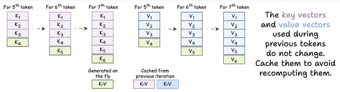
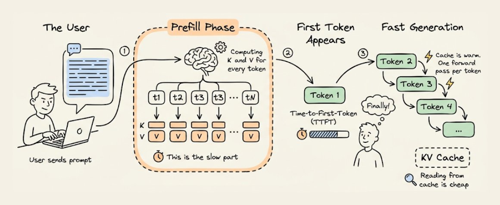

# KV Caching in LLMs, Clearly Explained

> - **Published:** 2026-03-20
> - **Source:** [KV Caching in LLMs, Clearly Explained](https://x.com/_avichawla/status/2034902650534187503)
> - **Tags:** `KV Caching`

You must have seen it every time you use ChatGPT or Claude that the first token takes noticeably longer to appear. Then the rest stream out almost instantly.

Behind the scenes, it's a deliberate engineering decision called KV caching, and the purpose is to make LLM inference faster.

Before we get into the technical details, here's a side-by-side comparison of LLM inference with and without KV caching:

<video src="../media/2603-kv-caching-llms-explained/v01.mp4" controls="controls" width="100%"></video>

Now let's understand how it works, from first principles.

## Part 1: How LLMs generate tokens

The transformer processes all input tokens and produces a hidden state for each one. Those hidden states get projected into vocabulary space, producing logits (one score per word in the vocabulary).

<video src="../media/2603-kv-caching-llms-explained/v02.mp4" autoplay loop muted playsinline width="100%"></video>

But only the logits from the last token matter. You sample from them, get the next token, append it to the input, and repeat.

<video src="../media/2603-kv-caching-llms-explained/v03.mp4" autoplay loop muted playsinline width="100%"></video>

This is the key insight: to generate the next token, you only need the hidden state of the most recent token. Every other hidden state is an intermediate byproduct.

## Part 2: What Attention actually computes

Inside each transformer layer, every token gets three vectors: a query (Q), a key (K), and a value (V). Attention multiplies queries against keys for scores, then uses those scores to weight the values.

<video src="../media/2603-kv-caching-llms-explained/v04.mp4" autoplay loop muted playsinline width="100%"></video>

Now focus on just the last token.

<video src="../media/2603-kv-caching-llms-explained/v05.mp4" autoplay loop muted playsinline width="100%"></video>

The last row of QK^T uses:

- The query vector of the last token
- All key vectors in the sequence

The final attention output for that row uses:

- The same query vector
- All key and value vectors

So to compute the only hidden state we need, every attention layer requires Q from the latest token, and K and V from everything.

## Part 3: The redundancy involved

Generating token 50 requires K and V vectors for tokens 1 through 50. Generating token 51 requires K and V vectors for tokens 1 through 51.

The K and V vectors for tokens 1 through 49 were already computed. They haven't changed. Same inputs, same outputs. Yet the model recomputes them from scratch every step.

That's O(n) redundant work per step. Over an entire generation, O(n²) wasted compute.

## Part 4: The fix

Instead of recomputing all K and V vectors at every step, store them. For each new token:

1. Compute Q, K, and V for only the newest token.
2. Append the new K and V to the cache.
3. Retrieve all previous K and V vectors from the cache.
4. Run attention using the new Q against the full cached K and V.

<video src="../media/2603-kv-caching-llms-explained/v06.mp4" autoplay loop muted playsinline width="100%"></video>

That's KV caching. One new K and one new V per layer per step. Everything else comes from memory.

The attention computation still scales with sequence length (you're attending over all keys and values). But the expensive projections to produce K and V happen only once per token, not once per step.

## Part 5: Time-to-First-Token

Now you can see why the first token is slow.

When you send a prompt, the model processes the entire input in one forward pass, computing and caching K and V vectors for every token. This is the prefill phase, and it's the most compute-intensive part of the request.

Once the cache is warm, each subsequent token needs only a single forward pass with one token.

That initial delay is called time-to-first-token (TTFT). Longer prompts mean longer prefills, which mean longer waits. Optimizing TTFT (chunked prefill, speculative decoding, prompt caching) is its own deep topic, but the dynamic is always the same: building the cache is expensive, reading from it is cheap.

## Part 6: The Tradeoff

KV caching trades compute for memory. Every layer stores K and V vectors for every token. For Qwen 2.5 72B (80 layers, 32K context, hidden dim 8192), the KV cache for a single request can consume several gigabytes of GPU memory. At hundreds of concurrent requests, it often exceeds the model weights themselves.

This is why grouped-query attention (GQA) and multi-query attention (MQA) exist: share key/value heads across query heads, cut memory, and minimal quality loss.

It's also why doubling context length is hard. Double the window, double the KV cache per request, fewer concurrent users.

There is another idea called Paged attention, which solves this, and I talked about it here recently: [Paged Attention in LLMs, clearly explained!](https://x.com/_avichawla/status/2031624056072712547)

## tl;dr

KV caching eliminates redundant computation during autoregressive generation. Previous tokens always produce the same K and V vectors, so you compute them once and store them. Each new token only needs its own Q, K, and V. Then, attention runs against the full cache.

5x speedup in practice. The cost is GPU memory, which becomes the binding constraint at scale. Every LLM serving stack (vLLM, TGI, TensorRT-LLM) builds on this idea.

<video src="../media/2603-kv-caching-llms-explained/v07.mp4" autoplay loop muted playsinline width="100%"></video>
